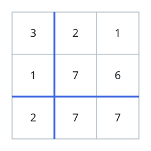
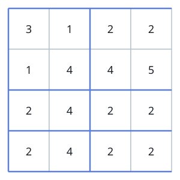

# Identical Rows and Columns

## Description

You are given an `n x n` integer matrix `grid` using 0-based indexing. Count
the pairs `(ri, cj)` — one row, one column — whose contents match exactly:
reading the row left to right yields the same values, in the same order, as
reading the column top to bottom. Return how many such pairs exist. Every
row is paired against every column independently, so a row that equals
several columns (or vice versa) contributes several pairs.

### Example 1



```text
Input: grid = [[3,2,1],[1,7,6],[2,7,7]]
Output: 1
Explanation: Exactly one pairing lines up:
- (Row 2, Column 1): both read [2,7,7].
```

### Example 2



```text
Input: grid = [[3,1,2,2],[1,4,4,5],[2,4,2,2],[2,4,2,2]]
Output: 3
Explanation: Three pairings line up:
- (Row 0, Column 0): [3,1,2,2]
- (Row 2, Column 2): [2,4,2,2]
- (Row 3, Column 2): [2,4,2,2]
```

### Constraints

- `n == grid.length == grid[i].length`
- `1 <= n <= 200`
- `1 <= grid[i][j] <= 10⁵`

## Hints

### Hint 1

The direct route compares every row against every column with nested
loops.

### Hint 2

Each such comparison itself needs a pass that walks the row and the column
element by element.

### Hint 3

A faster route treats each row and column as a single hashable value:
hash the rows, then count how many columns hit the stored sequences.
