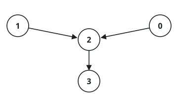
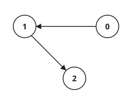

# Closest Shared Junction

## Description

Consider a directed graph over `n` nodes labeled `0` through `n - 1` in
which no node has more than one outgoing edge. The graph is handed to you
as a 0-indexed array `edges` of length `n`: node `i` points at node
`edges[i]`, and `edges[i] == -1` marks a node with no outgoing edge at
all. Cycles are allowed.

Together with the graph you receive two starting nodes, `node1` and
`node2`. Find a node that both walks can reach — one setting out from
`node1`, the other from `node2` — chosen so that the larger of its two
distances (from `node1` and from `node2`) is as small as possible. Return
that node's index. If several nodes tie, return the smallest index among
them, and if no node is reachable from both starts, return `-1`.

### Example 1



```text
Input: edges = [2,2,3,-1], node1 = 0, node2 = 1
Output: 2
Explanation: Node 2 sits one step out of node 0 and one step out of
node 1, so the larger of its two distances is 1. No reachable node
manages a smaller maximum distance, which makes node 2 the answer.
```

### Example 2



```text
Input: edges = [1,2,-1], node1 = 0, node2 = 2
Output: 2
Explanation: Walking from node 0 reaches node 2 in two steps, while
node 2 is already there at distance 0. The larger distance is 2, and
nothing reachable beats it, so the answer is node 2.
```

### Constraints

- `n == edges.length`
- `2 <= n <= 10⁵`
- `-1 <= edges[i] < n`
- `edges[i] != i`
- `0 <= node1, node2 < n`

## Hints

### Hint 1

Think about how to measure the distance from one starting node to every
node it can reach in this one-outgoing-edge graph.

### Hint 2

Trace the forced walk out of each start once to get two distance arrays,
then sweep the nodes for the one minimizing the larger of its two
distances.
