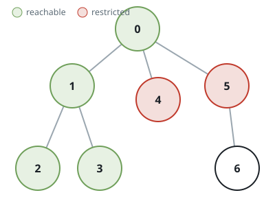
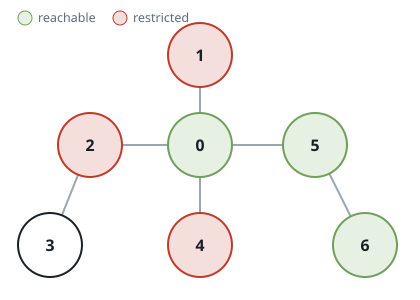

# Unblocked Nodes in a Tree

## Description

An undirected tree spans `n` nodes labeled `0` through `n - 1`, joined
by `n - 1` edges. The connections arrive as a 2D integer array `edges`
where `edges[i] = [ai, bi]` links nodes `ai` and `bi`. A separate array
`restricted` lists nodes that are off limits.

Starting at node `0`, walk along edges but never step onto any node in
`restricted`. Return how many nodes can be reached this way.

Node `0` itself is never restricted.

### Example 1



```text
Input: n = 7, edges = [[0,1],[1,2],[3,1],[4,0],[0,5],[5,6]], restricted = [4,5]
Output: 4
Explanation: The drawing above shows the tree. With nodes 4 and 5
blocked off, a walk from node 0 covers exactly the nodes [0, 1, 2, 3].
```

### Example 2



```text
Input: n = 7, edges = [[0,1],[0,2],[0,5],[0,4],[3,2],[6,5]], restricted = [4,2,1]
Output: 3
Explanation: The drawing above shows the tree. Blocking 1, 2, and 4
fences off most branches; only [0, 5, 6] stay within reach of node 0.
```

### Constraints

- `2 <= n <= 10⁵`
- `edges.length == n - 1`
- `edges[i].length == 2`
- `0 <= ai, bi < n` and `ai != bi`
- `edges` describes a valid tree.
- `1 <= restricted.length < n`
- `1 <= restricted[i] < n`
- Entries of `restricted` are pairwise distinct.

## Hints

### Hint 1

A single traversal is enough — in a tree every reachable node is
visited exactly once.

### Hint 2

Sweep outward from node 0, refusing to enter anything listed in
`restricted` and never revisiting a node already seen.

### Hint 3

Tally one for each node as it is visited; the final tally is the
answer.
