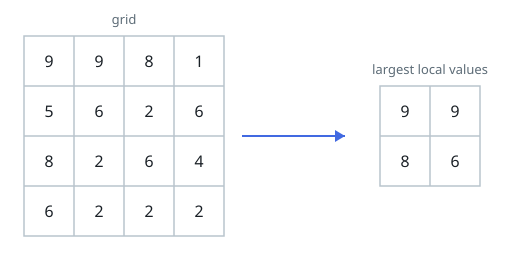
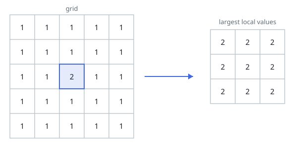

# Max Pooling

## Description

Given an `n x n` integer matrix `grid`, produce the pooled matrix `pooled`
of size `(n - 2) x (n - 2)`: entry `pooled[i][j]` is the largest value
inside the contiguous 3 x 3 block of `grid` whose top-left corner sits at
row `i`, column `j`. Every block of nine neighboring cells therefore
collapses to a single number — the block maximum.

Return `pooled`.

### Example 1



```text
Input: grid = [[9,9,8,1],[5,6,2,6],[8,2,6,4],[6,2,2,2]]
Output: [[9,9],[8,6]]
Explanation: The figure shows `grid` beside the pooled result. Each
output cell is the maximum of one 3 x 3 block: the top-left entry 9
covers the block rows 0-2, columns 0-2, and so on for the rest.
```

### Example 2



```text
Input: grid = [[1,1,1,1,1],[1,1,1,1,1],[1,1,2,1,1],[1,1,1,1,1],[1,1,1,1,1]]
Output: [[2,2,2],[2,2,2],[2,2,2]]
Explanation: The single 2 lies inside every 3 x 3 block of this grid, so
every pooled entry picks it up.
```

### Constraints

- `n == grid.length == grid[i].length`
- `3 <= n <= 100`
- `1 <= grid[i][j] <= 100`

## Hints

### Hint 1

A 3 x 3 block starting at `(i, j)` only exists when `i + 2` and `j + 2`
are valid rows and columns — that is exactly why the answer is
`(n - 2) x (n - 2)`.

### Hint 2

Collapsing each row of three into its maximum first, then taking the
vertical maximum of three of those results, reaches the same nine-cell
maximum with fewer comparisons than re-scanning all nine cells.
