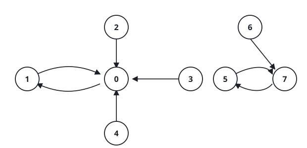
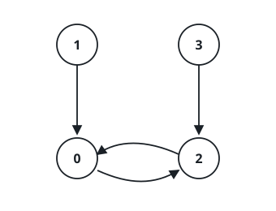

# Most Cited Node

## Description

Consider `n` nodes numbered `0` through `n - 1`, where every node directs
exactly one reference at another node (never at itself). The references
are given as a 0-indexed array `edges` of length `n`: node `i` cites node
`edges[i]`.

A node's citation total is the sum of the labels of every node that cites
it — a node nobody cites totals `0`. Return the node with the largest
citation total, breaking ties by the smallest label.

### Example 1



```text
Input: edges = [1,0,0,0,0,7,7,5]
Output: 7
Explanation: Node 0 is cited by 1, 2, 3 and 4, giving it a total of
1 + 2 + 3 + 4 = 10. Node 5 is cited by 7 only, and node 1 is cited by
node 0, so both stay below. Node 7 is cited by 5 and 6, for a total of
5 + 6 = 11 — the largest, so 7 is returned.
```

### Example 2



```text
Input: edges = [2,0,0,2]
Output: 0
Explanation: Node 0 is cited by nodes 1 and 2 (total 1 + 2 = 3), and
node 2 is cited by nodes 0 and 3 (total 0 + 3 = 3). Both reach the same
maximum, and the smaller label wins, so 0 is returned.
```

### Constraints

- `n == edges.length`
- `2 <= n <= 10⁵`
- `0 <= edges[i] < n`
- `edges[i] != i`

## Hints

### Hint 1

Keep one running total per node; reference `i` adds exactly `i` to the
total of `edges[i]`, so a single pass over the array settles every total.

### Hint 2

Comparing candidates in ascending node order and replacing the current
winner only on a strictly greater total leaves the smallest-index node on
top of any tie for free.

### Hint 3

Totals can approach the sum of all labels — far past 32 bits when `n` is
large — so fixed-width languages need 64-bit accumulators even though the
answer itself is a small label.
