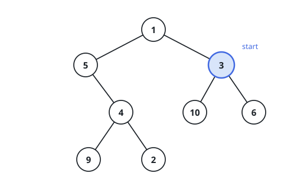

# Minutes to Blight the Whole Tree

## Description

A binary tree is given through its `root`, and every node carries a
distinct value. A tree blight breaks out at minute 0 in the one node
whose value equals `start`.

From then on, the blight advances by one edge every minute: any healthy
node that touches a blighted node — through a parent or child link — is
itself blighted the following minute. Report how many minutes pass
before every node in the tree has been blighted.

### Example 1



```text
Input: root = [1,5,3,null,4,10,6,9,2], start = 3
Output: 4
Explanation: Node 3 is blighted at minute 0. Its neighbors 1, 10, and 6
catch it at minute 1; node 5 follows at minute 2; node 4 at minute 3;
finally 9 and 2 at minute 4. Nothing healthy remains, so the answer is
4.
```

### Example 2


```text
Input: root = [1], start = 1
Output: 0
Explanation: The single node is the one that starts blighted, and the
tree is complete at minute 0.
```

### Constraints

- The tree holds between `1` and `10⁵` nodes.
- Every node value lies in `[1, 10⁵]` and no two are equal.
- The tree contains a node whose value is `start`.

## Hints

### Hint 1

Parent links are missing from a binary tree, yet the blight climbs
upward too — rebuild the structure as an undirected graph by recording
each parent-child pair as a two-way edge.

### Hint 2

One BFS layer away from the start value means one minute later, so run a
breadth-first sweep from `start`: the number of the deepest layer you
reach is the total time.

### Hint 3

Values never repeat, so a node's value can stand in for the node itself
everywhere — adjacency lists, the frontier, and the seen set.
