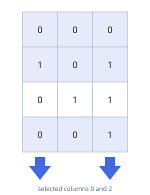
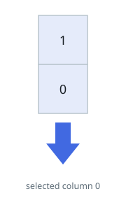

# Rows Cleared by a Column Pick

## Description

You are handed an `m x n` binary matrix `matrix` and a budget
`numSelect`. Pick exactly `numSelect` distinct columns of the matrix —
your pick. A row is cleared by the pick when every 1 it contains sits
in one of the chosen columns; a row with no 1s at all counts as cleared
too. No other row survives.

Choose the pick that clears as many rows as possible and return that
largest possible count.

Formally, with `picked = {c1, c2, ..., cnumSelect}` the chosen column
set, row `i` is cleared when each cell with `matrix[i][j] == 1` has `j`
in `picked`, or when row `i` holds no 1 whatsoever.

### Example 1

Input: matrix = [[0,0,0],[1,0,1],[0,1,1],[0,0,1]], numSelect = 2
Output: 3
Explanation:
The diagram shows one pick that clears three rows: columns {0, 2}.

- Row 0 carries no 1s, so it is cleared for free.
- Row 1's 1s sit in columns 0 and 2, both chosen, so it is cleared.
- Row 2 is not cleared: its 1 in column 1 misses the pick.
- Row 3's single 1 sits in column 2, which was chosen.
  The pick {1, 2} also clears three rows, and nothing clears more.

### Example 2

Input: matrix = [[1],[0]], numSelect = 1
Output: 2
Explanation:
With only one column in the matrix, choosing it selects the whole
matrix, and both rows are cleared.

### Example 3

Input: matrix = [[1,1,0],[0,0,1],[1,0,0]], numSelect = 2
Output: 2
Explanation:
Picking columns 0 and 1 clears the first and third rows; the second row
would need column 2 as well. No pick of two columns clears all three.

### Constraints

- `m == matrix.length`
- `n == matrix[i].length`
- `1 <= m, n <= 12`
- `matrix[i][j]` is either 0 or 1.
- `1 <= numSelect <= n`

## Hints

### Hint 1

The dimensions are tiny — an exhaustive search is affordable.

### Hint 2

Walk over every way to choose exactly `numSelect` of the `n` columns.

### Hint 3

For each candidate pick, count the rows it clears and report the best
count seen.
