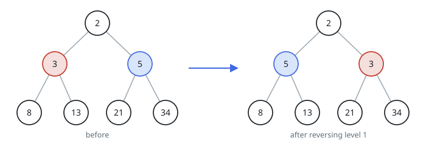
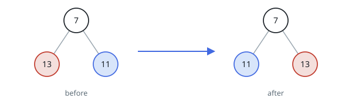

# Flip Odd Tree Levels

## Description

Given the `root` of a perfect binary tree, reverse the values held by the
nodes at every odd-numbered level of the tree. The level of a node is the
number of edges on the path from it to the root, so the root itself sits at
level `0`. Only values move — no node changes its children — and the tree
stays otherwise identical. Return the root of the flipped tree.

A binary tree is perfect when every internal node has two children and all
leaves lie on the same level.

### Example 1



```text
Input: root = [2,3,5,8,13,21,34]
Output: [2,5,3,8,13,21,34]
Explanation:
The tree has a single odd level. The level-1 nodes hold 3 and 5, which are
swapped to 5 and 3.
```

### Example 2



```text
Input: root = [7,13,11]
Output: [7,11,13]
Explanation:
The two level-1 nodes hold 13 and 11, which exchange to 11 and 13.
```

### Example 3

```text
Input: root = [10,20,30,40,50,60,70,80,90,100,110,120,130,140,150]
Output: [10,30,20,40,50,60,70,150,140,130,120,110,100,90,80]
Explanation:
The tree has three odd levels. Level 1 swaps 20 and 30. Level 2 keeps its
four values in place, and level 3 writes its eight values back in reverse
order.
```

### Constraints

- The number of nodes is in the range `[1, 2¹⁴]`.
- `0 <= Node.val <= 10⁵`
- `root` is a perfect binary tree.

## Hints

### Hint 1

Only values change, so each level can be mirrored independently of its
neighbors.

### Hint 2

Walk the tree level by level; whenever the current depth is odd, read the
level's values and write them back in reverse order.
