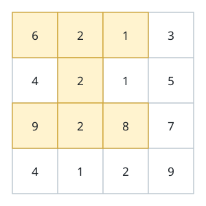
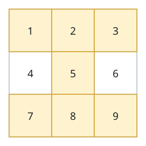

# Peak Hourglass Total

## Description

You are given an `m x n` integer matrix `grid`.

An hourglass is a cluster of seven cells shaped like the figure below:
the whole top row of a 3x3 block, its center cell, and the whole bottom
row.


```text
a b c
  d
e f g
```

Return the largest possible sum of the cells inside a single hourglass.
An hourglass cannot be rotated, and it must lie entirely inside the
matrix.

### Example 1



```text
Input: grid = [[6,2,1,3],[4,2,1,5],[9,2,8,7],[4,1,2,9]]
Output: 30
Explanation: The shaded cells mark the hourglass with the maximum sum:
6 + 2 + 1 + 2 + 9 + 2 + 8 = 30.
```

### Example 2



```text
Input: grid = [[1,2,3],[4,5,6],[7,8,9]]
Output: 35
Explanation: A 3x3 grid holds exactly one hourglass, and its cells sum to
1 + 2 + 3 + 5 + 7 + 8 + 9 = 35.
```

### Example 3

```text
Input: grid = [[3,4,5,1],[0,2,8,6],[7,9,1,4],[2,3,5,0]]
Output: 32
Explanation: The hourglass anchored at row 0, column 1 reads off as
4 + 5 + 1 + 8 + 9 + 1 + 4 = 32, the largest sum in this grid.
```

### Constraints

- `m == grid.length`
- `n == grid[i].length`
- `3 <= m, n <= 150`
- `0 <= grid[i][j] <= 10⁶`

## Hints

### Hint 1

Every 3x3 submatrix contains exactly one hourglass.

### Hint 2

Slide the 3x3 window across all top-left corners, summing the three top
cells, the center cell, and the three bottom cells, and keep the running
maximum.
