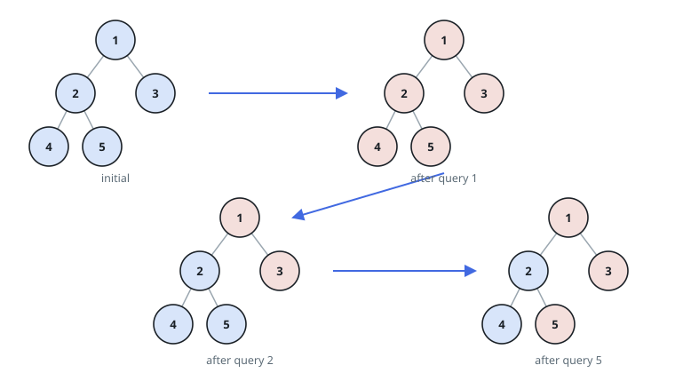
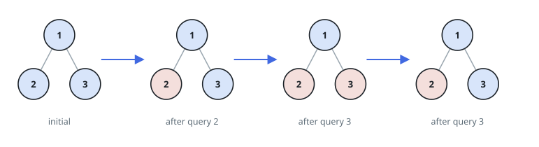

# Subtree Toggle Parity

## Description

Picture `n` positions numbered `1` through `n`, arranged as an implicit
binary tree: position `1` is the root, and every other position `v`
hangs directly below position `floor(v / 2)`, its parent. No edge list
is ever given — the parent of any label is always computable from the
label alone. For instance, with `n = 7`, position `3` hangs below
position `1` (`floor(3 / 2) = 1`), and position `7` hangs below
position `3` (`floor(7 / 2) = 3`).

Every position starts holding the value `0`. You are given an integer
array `queries`. Processing `queries[i]` toggles the value of every
position in the subtree rooted at `queries[i]` — that position itself
and everything hanging beneath it — flipping each `0` there to `1` and
each `1` there back to `0`.

After every entry of `queries` has been processed in order, return how
many positions hold the value `1`.

`floor(x)` means rounding `x` down to the nearest integer.

### Example 1



```text
Input: n = 5, queries = [1,2,5]
Output: 3
Explanation: The diagram shows the tree and the toggled state after
every query. Blue marks a position still at 0; red marks a position now
at 1. Three positions end up red: 1, 3, and 5.
```

### Example 2



```text
Input: n = 3, queries = [2,3,3]
Output: 1
Explanation: The diagram shows the tree and the toggled state after
every query. Position 3 is toggled twice by the two queries on it and
lands back on 0, leaving exactly one red position: 2.
```

### Example 3

```text
Input: n = 7, queries = [1,7]
Output: 6
Explanation: Querying position 1 toggles every position in the tree to
1, since its subtree is the whole tree. Querying position 7 then
toggles only position 7 back to 0. The six positions 1-6 stay at 1.
```

### Example 4

```text
Input: n = 4, queries = [2,2]
Output: 0
Explanation: Both queries target the same subtree (position 2 and
position 4), so each position in it is toggled twice and returns to 0.
No position ends at 1.
```

### Example 5

```text
Input: n = 6, queries = [3,1,6,2]
Output: 2
Explanation: Tracking the running parity of each position across all
four queries leaves exactly positions 1 and 6 at value 1.
```

### Constraints

- `1 <= n <= 10⁵`
- `1 <= queries.length <= 10⁵`
- `1 <= queries[i] <= n`
