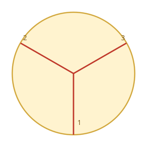

# Equal Circle Slices

## Description

A cut on a circle takes one of two forms:

- A straight line through the center that touches two points on the
  circumference (a diameter), or
- A straight segment from the center to a single point on the circumference
  (a radius).

Some valid and invalid cuts are shown below.


Given an integer `n`, return the minimum number of cuts needed to divide the
circle into `n` equal slices.

### Example 1


```text
Input: n = 4
Output: 2
Explanation: The figure shows how cutting the circle twice through the
middle divides it into 4 equal slices.
```

### Example 2



```text
Input: n = 3
Output: 3
Explanation: At least 3 cuts are needed to divide the circle into 3 equal
slices. It can be shown that fewer than 3 cuts cannot produce 3 slices of
equal size and shape. Note that the first cut alone does not divide the
circle into distinct parts.
```

### Example 3

```text
Input: n = 1
Output: 0
Explanation: The whole circle is already a single slice, so no cut is
needed at all.
```

### Example 4

```text
Input: n = 6
Output: 3
Explanation: Three diameter cuts, rotated 60 degrees apart, split the
circle into six equal slices.
```

### Constraints

- `1 <= n <= 100`

## Hints

### Hint 1

Consider odd and even values of `n` separately.

### Hint 2

A diameter supplies two boundary rays at once; an odd slice count can never
pair its boundaries into diameters.

### Hint 3

When is no cut needed at all?
