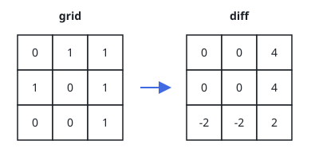
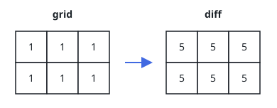

# Row Column Difference

## Description

You are given a 0-indexed `m x n` binary matrix `grid`.

Build the 0-indexed `m x n` difference matrix `diff` as follows:

- Let `onesRow[i]` be the number of ones in row `i`.
- Let `onesCol[j]` be the number of ones in column `j`.
- Let `zerosRow[i]` be the number of zeros in row `i`.
- Let `zerosCol[j]` be the number of zeros in column `j`.

Then `diff[i][j] = onesRow[i] + onesCol[j] - zerosRow[i] - zerosCol[j]`.

Return the difference matrix `diff`.

### Example 1



```text
Input: grid = [[0,1,1],[1,0,1],[0,0,1]]
Output: [[0,0,4],[0,0,4],[-2,-2,2]]
Explanation:
- diff[0][0] = onesRow0 + onesCol0 - zerosRow0 - zerosCol0 = 2 + 1 - 1 - 2 = 0
- diff[0][1] = onesRow0 + onesCol1 - zerosRow0 - zerosCol1 = 2 + 1 - 1 - 2 = 0
- diff[0][2] = onesRow0 + onesCol2 - zerosRow0 - zerosCol2 = 2 + 3 - 1 - 0 = 4
- diff[1][0] = onesRow1 + onesCol0 - zerosRow1 - zerosCol0 = 2 + 1 - 1 - 2 = 0
- diff[1][1] = onesRow1 + onesCol1 - zerosRow1 - zerosCol1 = 2 + 1 - 1 - 2 = 0
- diff[1][2] = onesRow1 + onesCol2 - zerosRow1 - zerosCol2 = 2 + 3 - 1 - 0 = 4
- diff[2][0] = onesRow2 + onesCol0 - zerosRow2 - zerosCol0 = 1 + 1 - 2 - 2 = -2
- diff[2][1] = onesRow2 + onesCol1 - zerosRow2 - zerosCol1 = 1 + 1 - 2 - 2 = -2
- diff[2][2] = onesRow2 + onesCol2 - zerosRow2 - zerosCol2 = 1 + 3 - 2 - 0 = 2
```

### Example 2



```text
Input: grid = [[1,1,1],[1,1,1]]
Output: [[5,5,5],[5,5,5]]
Explanation: Every row and column is all ones, so each row and column has
three ones and zero zeros; every cell gets 3 + 2 - 0 - 0 = 5.
```

### Example 3

```text
Input: grid = [[0,0],[0,0]]
Output: [[-4,-4],[-4,-4]]
Explanation: Each row and each column has zero ones and two zeros, so every
cell gets 0 + 0 - 2 - 2 = -4.
```

### Example 4

```text
Input: grid = [[1]]
Output: [[2]]
Explanation: The single cell lies in the only row and the only column, each
with one one and zero zeros, giving 1 + 1 - 0 - 0 = 2.
```

### Constraints

- `m == grid.length`
- `n == grid[i].length`
- `1 <= m, n <= 10⁵`
- `1 <= m * n <= 10⁵`
- `grid[i][j]` is either `0` or `1`.

## Hints

### Hint 1

Each row's one-count is reused across every cell of that row, and each
column's one-count across every cell of that column — store them once
instead of recomputing per cell.

### Hint 2

Once the one-count of a row or column is known, its zero-count follows
immediately from the row width or column height.

### Hint 3

Substituting the zero-counts into the definition collapses the four terms
into a closed form involving only the two one-counts and the dimensions.
