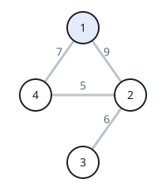
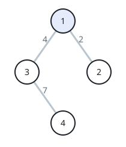

# Cheapest Link Between Cities

## Description

You are given a positive integer `n` naming `n` cities numbered `1`
through `n`, and a 2D array `roads` where `roads[i] = [ai, bi, distancei]`
describes a bidirectional road of length `distancei` between cities `ai`
and `bi`. The city graph is not necessarily connected.

The score of a path between two cities is the smallest road distance among
all the roads the path uses.

Return the minimum possible score of a path from city `1` to city `n`.

Notes:

- A path is any sequence of roads between two cities.
- A path may use the same road more than once and may visit cities `1` and
  `n` repeatedly along the way.
- The input is generated so that at least one path from `1` to `n` exists.

### Example 1



```text
Input: n = 4, roads = [[1,2,9],[2,3,6],[2,4,5],[1,4,7]]
Output: 5
Explanation: The path 1 -> 2 -> 4 uses roads of length 9 and 5, so its
score is min(9, 5) = 5, and no other path does better.
```

### Example 2



```text
Input: n = 4, roads = [[1,2,2],[1,3,4],[3,4,7]]
Output: 2
Explanation: The path 1 -> 2 -> 1 -> 3 -> 4 revisits city 1 and reuses
the road 1-2, yet its roads are 2, 2, 4, and 7, so the score is
min(2, 2, 4, 7) = 2.
```

### Example 3

```text
Input: n = 5, roads = [[1,2,1],[2,3,2],[3,4,3],[4,5,4]]
Output: 1
Explanation: The graph is one connected chain, so city 1's component holds
every road; the shortest of them, the length-1 road 1-2, gives the score
of the path 1 -> 2 -> 3 -> 4 -> 5.
```

### Constraints

- `2 <= n <= 10⁵`
- `1 <= roads.length <= 10⁵`
- `roads[i].length == 3`
- `1 <= ai, bi <= n`
- `ai != bi`
- `1 <= distancei <= 10⁴`
- There are no repeated edges.
- There is at least one path between `1` and `n`.

## Hints

### Hint 1

Because a road can be reused, any road whose two endpoints are reachable
from city 1 can be worked into a valid path at no extra score.

### Hint 2

The answer is therefore the smallest road distance among every road that
lies inside the connected component containing city 1.

### Hint 3

Union the endpoints of every road, then scan the roads once for the
minimum distance whose two endpoints share city 1's root.
