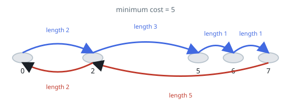
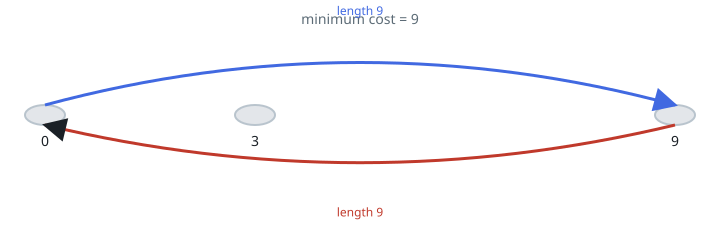

# Round-Trip Bottleneck Jump

## Description

Stones at strictly increasing positions `stones[0] < ... < stones[n-1]` span
a river. A frog starts on the first stone, must visit the last stone, and
must return to the first — landing on any intermediate stone at most once
across the whole trip. The length of one jump is the distance between the two
stones it connects, and the cost of a trip is the longest single jump it
makes.

Return the minimum possible cost.

### Example 1



```text
Input: stones = [0,2,5,6,7]
Output: 5
Explanation: One optimal trip is drawn above; its longest jump has length 5,
and no trip can do better.
```

### Example 2



```text
Input: stones = [0,3,9]
Output: 9
Explanation: The frog jumps straight out and straight back, two jumps of
length 9.
```

### Constraints

- `2 <= stones.length <= 10⁵`
- `0 <= stones[i] <= 10⁹`
- `stones[0] == 0`
- `stones` is strictly increasing.

## Hints

### Hint 1

An optimal strategy visits every stone, splitting them between the outgoing
and return legs.

### Hint 2

Skipping every other stone on the way out — and letting the skipped ones be
the return leg — keeps the maximum jump as small as possible.
