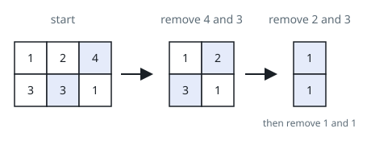
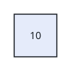

# Collect Row Maxima

## Description

A `m x n` grid holds positive integers. Repeat until the grid is empty: in
each row, remove one cell holding that row's current maximum (any one when
several tie), then add the largest of all the just-removed values to a
running answer. Each round shrinks the grid by one column.

Return the final answer.

### Example 1



```text
Input: grid = [[1,2,4],[3,3,1]]
Output: 8
Explanation: The first round removes 4 and 3 (answer 4), the second removes
2 and 3 (answer 7), and the third removes 1 and 1 (answer 8).
```

### Example 2



```text
Input: grid = [[10]]
Output: 10
Explanation: A single round removes the only cell.
```

### Constraints

- `m == grid.length`
- `n == grid[i].length`
- `1 <= m, n <= 50`
- `1 <= grid[i][j] <= 100`

## Hints

### Hint 1

Sort each row descending; after every row is sorted, each round simply takes
the next column.

### Hint 2

The answer is the sum, over columns, of that column's maximum across the
sorted rows.
