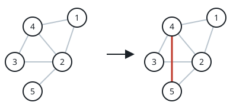

# Even Degrees With Two Added Edges

## Description

An undirected graph has `n` nodes labeled `1` through `n`, described by the
list `edges`, where each `edges[i] = [ai, bi]` joins nodes `ai` and `bi`.
The graph may be disconnected, and its edge list contains no duplicates.

You may insert at most two new edges — possibly inserting none — provided
the additions create no self-loop and no duplicate of an existing (or
newly added) edge. Decide whether the degrees of all `n` nodes can be made
even this way, where a node's degree is how many edges touch it.

### Example 1



```text
Input: n = 5, edges = [[1,2],[2,3],[3,4],[4,2],[1,4],[2,5]]
Output: true
Explanation: The diagram above shows one acceptable placement of a new
edge; afterwards every node touches an even number of edges.
```

### Example 2


```text
Input: n = 4, edges = [[1,2],[3,4]]
Output: true
Explanation: The diagram above shows a way to spend both allowed edges.
```

### Example 3


```text
Input: n = 4, edges = [[1,2],[1,3],[1,4]]
Output: false
Explanation: No arrangement of at most two extra edges can make every
degree even here.
```

### Constraints

- `3 <= n <= 10⁵`
- `2 <= edges.length <= 10⁵`
- `edges[i].length == 2`
- `1 <= ai, bi <= n`
- `ai != bi`
- The given edges are all distinct.

## Hints

### Hint 1

A newly added edge changes the parity of exactly its two endpoints — and
nothing else.

### Hint 2

The original graph must contain 0, 2, or 4 odd-degree nodes; handle each
of these three counts on its own.
