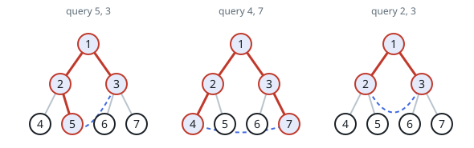

# Sizing the Cycle a Query Creates

## Description

You are given an integer `n` describing a perfect binary tree with
`2ⁿ - 1` nodes. The root carries the value `1`, and every node `val` with
`1 <= val <= 2ⁿ⁻¹ - 1` has two children:

- a left child valued `2 * val`, and
- a right child valued `2 * val + 1`.

You are also given a 2D integer array `queries` of length `m`, where
`queries[i] = [ai, bi]`. Handle the queries one at a time. For each one:

- connect nodes `ai` and `bi` with one temporary extra edge,
- measure the length of the cycle that now exists in the graph, and
- remove the extra edge again before the next query.

A cycle is a route that begins and ends at the same node and never reuses
an edge, and its length is how many edges the route crosses. The temporary
edge is allowed to run parallel to an existing tree edge, so a query may
join two nodes that are already directly connected.

Return an array `answer` of length `m` where `answer[i]` is the cycle
length produced by query `i`.

### Example 1



```text
Input: n = 3, queries = [[5,3],[4,7],[2,3]]
Output: [4,5,3]
Explanation: The diagrams above show the tree of 2³ - 1 nodes; the red
nodes are the ones lying on each cycle. Joining 3 and 5 closes the loop
5-2-1-3, which crosses 4 edges. Joining 4 and 7 closes the loop 4-2-1-3-7,
which crosses 5 edges. Joining 2 and 3 closes the loop 2-1-3, which
crosses 3 edges. Each extra edge is removed again before the next query.
```

### Example 2


```text
Input: n = 2, queries = [[1,2]]
Output: [2]
Explanation: The diagram above shows the tree of 2² - 1 nodes. Nodes 1 and
2 are already joined by a tree edge, so the added edge parallels it and
the resulting loop crosses 2 edges.
```

### Constraints

- `2 <= n <= 30`
- `m == queries.length`
- `1 <= m <= 10⁵`
- `queries[i].length == 2`
- `1 <= ai, bi <= 2ⁿ - 1`
- `ai != bi`

## Hints

### Hint 1

The new edge closes a loop precisely along the tree's unique path from `a`
to `b`, so the question is really: how long is that path?

### Hint 2

In this numbering scheme a node's parent is its value halved (floor). Lift
whichever endpoint currently holds the larger value until the two meet —
the number of lifts equals the path length.

### Hint 3

The same result falls out of the common-ancestor formula: path length is
the two depths minus twice the depth of the deepest shared ancestor.
