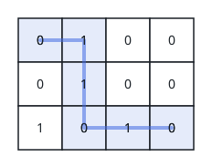
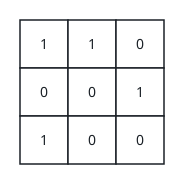

# Balanced Digit Path

## Description

You are given a binary matrix `grid` with `m` rows and `n` columns, indexed
from zero. From the top-left cell you may repeatedly take one step down or
one step right, and every cell you land on holds either a `0` or a `1`.

Such a walk always touches exactly `m + n - 1` cells before it arrives at
the bottom-right cell. Return `true` if at least one walk of this kind
passes over as many `0` cells as `1` cells; return `false` when every
possible walk ends up lopsided.

### Example 1



```text
Input: grid = [[0,1,0,0],[0,1,0,0],[1,0,1,0]]
Output: true
Explanation: The highlighted walk picks up three 0s and three 1s, so its
two digit counts cancel out exactly. A qualifying walk exists, hence the
answer is true.
```

### Example 2



```text
Input: grid = [[1,1,0],[0,0,1],[1,0,0]]
Output: false
Explanation: However you trace a route through this grid, the counts of
0s and 1s never even out — no walk qualifies.
```

### Constraints

- `m == grid.length`
- `n == grid[i].length`
- `2 <= m, n <= 100`
- `grid[i][j]` is `0` or `1`.

## Hints

### Hint 1

Dynamic programming over the grid works: a cell's state can summarize
every walk that stops there.

### Hint 2

Track the running imbalance — ones seen minus zeros seen — rather than
both counts. A walk ending at cell `(i, j)` has already visited `i + j + 1`
cells, so its imbalance stays between `-(m + n - 1)` and `m + n - 1`. Let
`dp[i][j][d]` record whether some walk to `(i, j)` carries imbalance `d`;
each cell extends the states of its top and left neighbours by `+1` or
`-1`, and the answer is `dp[m - 1][n - 1][0]`.
