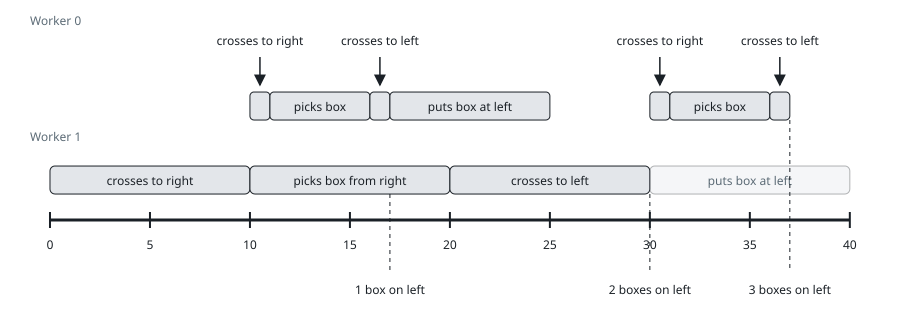

# Shipping Crates Across the Footbridge

## Description

Two warehouses sit on opposite banks of a river, joined by a single
footbridge, and `n` crates must travel from the right-bank warehouse to
the one on the left. `k` porters are on duty. You are given the integers
`n` and `k`, and a 2D array `time` of size `k x 4` where
`time[i] = [right_i, pick_i, left_i, put_i]`:

- `right_i` — minutes porter `i` needs to walk across to the right bank;
- `pick_i` — minutes to lift a crate inside the right warehouse;
- `left_i` — minutes to walk back across to the left bank;
- `put_i` — minutes to set the crate down in the left warehouse.

Every porter starts on the left bank. Porter `i` is the clumsier walker
compared with porter `j` when either holds:

- `left_i + right_i > left_j + right_j`;
- `left_i + right_i == left_j + right_j` and `i > j`.

Traffic on the bridge follows three rules:

- The bridge carries at most one porter at a time.
- Whenever the bridge sits unused, a loaded porter waiting on the right
  bank crosses first — the clumsiest such porter; if that bank is empty,
  the clumsiest waiting porter on the left bank crosses instead.
- Once the porters already dispatched can collect every remaining crate,
  nobody new leaves the left bank.

Return the minute at which the last crate reaches the left side of the
bridge.

### Example 1

```text
Input: n = 1, k = 2, time = [[1,2,1,2],[3,1,2,1]]
Output: 6
Explanation: Porter 1 is the clumsier walker (2 + 3 beats 1 + 1), so he
goes first: 0 to 3 crossing, 3 to 4 lifting the crate, 4 to 6 walking
back. The final set-down is skipped, so the crate reaches the left bank
at minute 6.
```

### Example 2



```text
Input: n = 3, k = 2, time = [[1,5,1,8],[10,10,10,10]]
Output: 37
Explanation: The final crates reach the left bank at minute 37. They are
never set down: they are already across with their porters, and a
set-down would only add time.
```

### Example 3

```text
Input: n = 2, k = 2, time = [[1,1,1,1],[1,1,1,1]]
Output: 4
Explanation: The tie goes to the larger index, so porter 1 crosses first
(0 to 1) and porter 0 follows the moment the bridge clears (1 to 2).
Porter 1 lifts his crate at 1, waits out porter 0's crossing, and lands
it at 3; porter 0 lifts at 2 and lands the last crate at 4.
```

### Constraints

- `1 <= n, k <= 10⁴`
- `time.length == k`
- `time[i].length == 4`
- `1 <= left_i, pick_i, right_i, put_i <= 1000`

## Hints

### Hint 1

Play the schedule out by hand: at any instant the whole state is just
who stands where, who carries what, and when the bridge frees up.

### Hint 2

"Clumsiest first" is a priority query — a heap over each bank's waiting
porters answers it in a single step.
