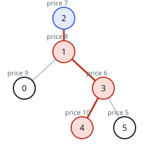
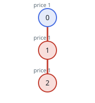

# Rooting for the Widest Price Spread

## Description

An undirected, unrooted tree holds `n` nodes numbered `0` through
`n - 1`. You are given the integer `n` and an array `edges` of length
`n - 1`, where `edges[i] = [ai, bi]` says that nodes `ai` and `bi` are
joined by an edge.

Every node carries a price: `price[i]` is the price of node `i`.

The price sum of a path is the total of the prices of all nodes the path
visits.

Pick any node to serve as the root. Once that choice is made, the
incurred cost is the gap between the largest and the smallest price sum
over all paths that begin at the root.

Choose the root as well as possible: return the greatest cost any choice
can achieve.

### Example 1



```text
Input: n = 6, edges = [[0,1],[1,2],[1,3],[3,4],[3,5]], price = [9,8,7,6,10,5]
Output: 24
Explanation: The diagram shows the tree rooted at node 2, with the
richest path colored red and the cheapest colored blue.
- The rich path visits nodes [2,1,3,4] with prices [7,8,6,10], a price
  sum of 31.
- The cheap path is the single node [2] with price [7].
The spread is 31 - 7 = 24, and no other rooting does better.
```

### Example 2



```text
Input: n = 3, edges = [[0,1],[1,2]], price = [1,1,1]
Output: 2
Explanation: The diagram shows the tree rooted at node 0, with the
richest path colored red and the cheapest colored blue.
- The rich path visits nodes [0,1,2] with prices [1,1,1], a price sum
  of 3.
- The cheap path is the single node [0] with price [1].
The spread is 3 - 1 = 2, and no other rooting does better.
```

### Constraints

- `1 <= n <= 10⁵`
- `edges.length == n - 1`
- `0 <= ai, bi <= n - 1`
- `edges` describes a valid tree.
- `price.length == n`
- `1 <= price[i] <= 10⁵`

## Hints

### Hint 1

Prices are all positive, so the cheapest path leaving any root is the
root by itself — a root's cost is its richest path sum minus its own
price, and you want the best cost over all roots.

### Hint 2

Fix one rooting for the whole analysis. A path starting at the chosen
root then runs straight down: either one downward chain into a single
subtree, or two chains rising from two different children that meet at
the chosen node.

### Hint 3

One depth-first pass suffices: for each node return the best downward
chain ending at a leaf, and the same chain with the leaf's price
removed. Combining the two best children at every node (plus the node's
own price) covers the two-chain case, and the one-chain case comes out
of the same sweep.
