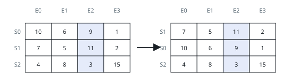
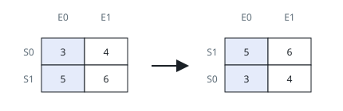

# Ranking the Class by One Exam

## Description

A class has `m` students, each of whom sat `n` exams. You are given a
0-indexed `m x n` integer matrix `score`, where row `i` is student `i`'s
record and `score[i][j]` is the grade that student earned on exam `j`.
Every entry in the matrix is distinct.

You are also given an integer `k`. Reorder the rows of the matrix so
that the students stand in decreasing order of their grade on exam `k`
(the 0-indexed one), each row carried along whole.

Return the reordered matrix.

### Example 1



```text
Input: score = [[10,6,9,1],[7,5,11,2],[4,8,3,15]], k = 2
Output: [[7,5,11,2],[10,6,9,1],[4,8,3,15]]
Explanation: In the diagram, S marks a student and E an exam.
- On exam 2, the student in row 1 holds the top grade of 11 and takes
first place.
- The student in row 0 scored 9 there, the next-best grade, and comes
second.
- The student in row 2 scored 3 there, the weakest grade, and lands
last.
```

### Example 2



```text
Input: score = [[3,4],[5,6]], k = 0
Output: [[5,6],[3,4]]
Explanation: In the diagram, S marks a student and E an exam.
- On exam 0, the row-1 student's 5 beats the row-0 student's 3, so the
rows swap.
```

### Constraints

- `m == score.length`
- `n == score[i].length`
- `1 <= m, n <= 250`
- `1 <= score[i][j] <= 10⁵`
- Every entry of `score` is pairwise distinct.
- `0 <= k < n`

## Hints

### Hint 1

Spot the row whose entry in column `k` is the largest anywhere in the
matrix and bring it to the top.

### Hint 2

Then repeat the same selection for the rows left below; the matrix ends
up ordered one row at a time.
