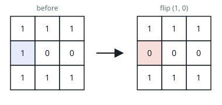
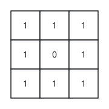

# Severing the Route with One Flip

## Description

You are given a 0-indexed m x n binary matrix `grid`. From a cell
`(row, col)` you may step to `(row + 1, col)` or `(row, col + 1)`, but
only when that cell contains a 1. The matrix counts as disconnected when
no sequence of such steps leads from `(0, 0)` to `(m - 1, n - 1)`.

Before the check you may flip the value of at most one cell — possibly
none — though `(0, 0)` and `(m - 1, n - 1)` themselves can never be
flipped. A flip swaps a 0 for a 1 or a 1 for a 0.

Return true if at most one flip can leave the matrix disconnected, and
false otherwise.

### Example 1



```text
Input: grid = [[1,1,1],[1,0,0],[1,1,1]]
Output: true
Explanation: Turning the marked cell (1, 0) from 1 to 0, as the right
grid shows, severs the only surviving route, so nothing connects
(0, 0) to (2, 2) any more.
```

### Example 2



```text
Input: grid = [[1,1,1],[1,0,1],[1,1,1]]
Output: false
Explanation: Two routes sharing no interior cells — one across the top
row and down the right column, one down the left column and across the
bottom row — survive whatever you flip, so a single change can never cut
both.
```

### Constraints

- `m == grid.length`
- `n == grid[i].length`
- `1 <= m, n <= 1000`
- `1 <= m * n <= 10⁵`
- `grid[i][j]` is 0 or 1.
- `grid[0][0] == grid[m - 1][n - 1] == 1`

## Hints

### Hint 1

Treat the 1-cells as vertices of a graph whose edges run right and down
between adjacent cells.

### Hint 2

Two routes from corner to corner that share no cell besides the
endpoints make the answer false; if no such pair exists, one
well-chosen flip always severs everything.
