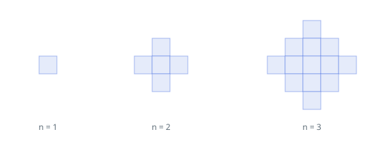

# The Growing Blue Diamond

## Description

Picture an unbounded grid of unit cells, every one of them uncolored.
You are given a positive integer `n`, the number of minutes the
following routine runs:

- During minute 1, one cell of your choosing turns blue.
- During every minute after that, each uncolored cell that shares an
  edge with some blue cell turns blue as well.

The picture below shows how the blue region stands after minutes 1,
2, and 3.



Report how many cells are blue once minute `n` ends.

### Example 1

```text
Input: n = 1
Output: 1
Explanation: One minute colors exactly the single starting cell.
```

### Example 2

```text
Input: n = 2
Output: 5
Explanation: The starting cell keeps its four edge-neighbors blue,
and only those: the blue patch is the 5-cell diamond in the figure.
```

### Example 3

```text
Input: n = 4
Output: 25
Explanation: The diamond keeps widening by one ring per minute — 1,
5, 13, and then 25 cells after the fourth minute.
```

### Constraints

- `1 <= n <= 10⁵`

## Hints

### Hint 1

Look for a closed-form relation between the count of blue cells and
the elapsed minutes rather than simulating the growth.

### Hint 2

Minute `k` adds one diamond ring around everything already blue. The
ring at distance `k` from the first cell holds `4*k` cells, and the
rings' sizes sum to a familiar quadratic in `n`.
