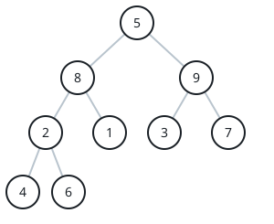
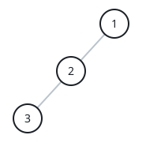

# Ranking the Level Sums of a Tree

## Description

You are handed the `root` of a binary tree and a positive integer
`k`. Slice the tree into levels: two nodes belong to the same level
exactly when they sit at the same distance from the root. A level's
sum is the total of the values carried by that level's nodes.

Return the `k`-th largest of these level sums, with ties counting
separately — the sums are ranked as a multiset, not a set of
distinct values. If the tree has fewer than `k` levels, return `-1`.

### Example 1



```text
Input: root = [5,8,9,2,1,3,7,4,6], k = 2
Output: 13
Explanation: Reading the levels top to bottom gives sums 5,
8 + 9 = 17, 2 + 1 + 3 + 7 = 13, and 4 + 6 = 10. Ranked largest
first — 17, 13, 10, 5 — the second entry is 13.
```

### Example 2



```text
Input: root = [1,2,null,3], k = 1
Output: 3
Explanation: The levels hold 1, then 2, then 3, so the largest
level sum is 3.
```

### Constraints

- The tree contains `n` nodes.
- `2 <= n <= 10⁵`
- `1 <= Node.val <= 10⁶`
- `1 <= k <= n`

## Hints

### Hint 1

Walk the tree once and total the values level by level; after that,
answering the ranking question only needs the k largest of those
totals.

### Hint 2

Either a depth-first walk that carries each node's depth or a
breadth-first sweep that finishes one level at a time will produce
the per-level sums.
