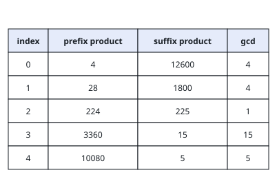
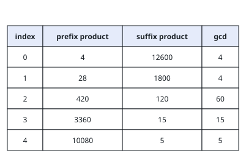

# No Shared Primes Across the Split

## Description

You are given an integer array `nums` of length `n`, indexed from `0`.
Pick an index `i` with `0 <= i <= n - 2` and cut the array there: the
prefix `nums[0..i]` and the suffix `nums[i + 1..n - 1]` each contribute
the product of their elements. The cut is called valid when those two
products are coprime, meaning their greatest common divisor is exactly
`1`.

For instance, with `[2, 3, 3]` the cut after the first element is valid
because the products `2` and `9` share no prime at all, while the cut
after the second element fails since `6` and `3` are both divisible by
`3`. A cut after the final element is not a candidate at all, so
`i = n - 1` never qualifies.

Return the smallest index `i` that admits a valid cut, or `-1` if no
such index exists.

### Example 1



```text
Input: nums = [4,7,8,15,3,5]
Output: 2
Explanation: The table above lists, for every index, the prefix product,
the suffix product, and their gcd. Only the cut at index 2 yields a gcd
of 1.
```

### Example 2



```text
Input: nums = [4,7,15,8,3,5]
Output: -1
Explanation: The table above lists, for every index, the prefix product,
the suffix product, and their gcd. No cut produces a gcd of 1, so there
is nothing to return but -1.
```

### Constraints

- `n == nums.length`
- `1 <= n <= 10⁴`
- `1 <= nums[i] <= 10⁶`

## Hints

### Hint 1

Coprime products have disjoint prime factor sets — compare factors,
never the astronomically large products themselves.

### Hint 2

Each prime occurring in the array covers a span of positions from its
first occurrence to its last; a cut at `i` works exactly when no prime's
span crosses it.
