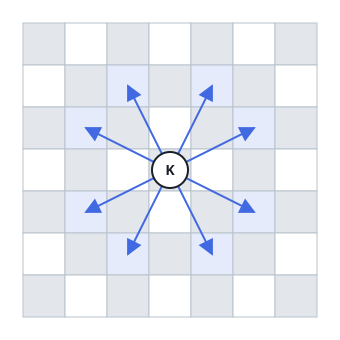
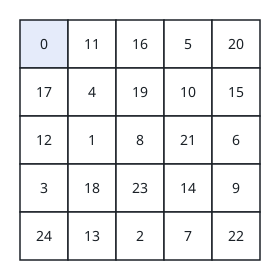
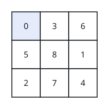

# The Knight's Round Trip

## Description

A knight travels an `n x n` chessboard, and a tour plan records where it
goes: the plan is sound when the knight begins in the top-left corner
cell and lands on every cell of the board exactly once.

You are given an `n x n` matrix `grid` holding each value from `0` to
`n * n - 1` exactly once, where `grid[row][col]` says that the cell
`(row, col)` is the `grid[row][col]`-th stop of the trip, counting from
zero.

Return `true` when `grid` encodes a sound trip for the knight and
`false` otherwise.

Recall that a knight hops two squares in one direction and one square
perpendicular to it. The figure below shows the eight cells a knight can
reach from a given starting cell.



### Example 1



```text
Input: grid = [[0,11,16,5,20],[17,4,19,10,15],[12,1,8,21,6],[3,18,23,14,9],[24,13,2,7,22]]
Output: true
Explanation: The diagram above lays out this board. Every consecutive
pair of stops is a knight hop apart, so the trip is sound.
```

### Example 2



```text
Input: grid = [[0,3,6],[5,8,1],[2,7,4]]
Output: false
Explanation: The diagram above lays out this board. Following the stops
in order, the hop from the cell holding 7 to the cell holding 8 is not
a knight move, so the plan fails.
```

### Example 3

```text
Input: grid = [[1,2,3],[4,5,6],[7,8,0]]
Output: false
Explanation: The value 0 must sit in the top-left cell for the trip to
start there; here it sits in the bottom-right corner instead.
```

### Constraints

- `n == grid.length == grid[i].length`
- `3 <= n <= 7`
- `0 <= grid[row][col] < n * n`
- All values in `grid` are distinct.

## Hints

### Hint 1

Validity is a purely local question: it suffices to inspect each
consecutive pair of stops.

### Hint 2

For each pair, compare the row and column deltas against the two shapes
a knight hop can have.
