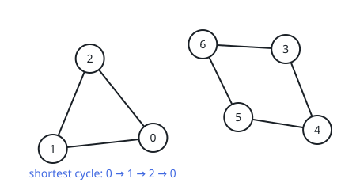

# Tightest Loop in a Graph

## Description

An undirected graph has `n` vertices labeled `0` through `n - 1`, and its
edges are given as a 2D integer array `edges`, where `edges[i] = [ui, vi]`
joins vertices `ui` and `vi`. No vertex is joined to itself, and no pair of
vertices is joined by more than one edge.

A loop is a route that begins and ends at the same vertex and never travels
along the same edge twice.

Return the number of edges in the tightest loop the graph contains, or `-1`
if the graph holds no loop at all.

### Example 1



```text
Input: n = 7, edges = [[0,1],[1,2],[2,0],[3,4],[4,5],[5,6],[6,3]]
Output: 3
Explanation: The tightest loop is 0 -> 1 -> 2 -> 0, which uses three
edges.
```

### Example 2


```text
Input: n = 4, edges = [[0,1],[0,2]]
Output: -1
Explanation: No route in this graph can return to its starting vertex, so
the graph has no loop.
```

### Constraints

- `2 <= n <= 1000`
- `1 <= edges.length <= 1000`
- `edges[i].length == 2`
- `0 <= ui, vi < n`
- `ui != vi`
- No edge appears more than once.

## Hints

### Hint 1

Breadth-first search is the natural tool here — what does it mean when two
discovery routes reach the same vertex?

### Hint 2

Run a BFS from every vertex `u`. The first meeting of two routes measures
the shortest loop that passes through `u`; the answer is the best of those
measurements.
