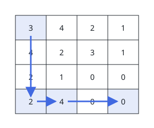
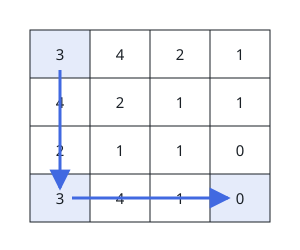
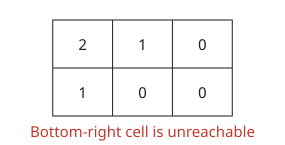

# Fewest Cells Crossed

## Description

You stand on a 0-indexed `m x n` integer matrix `grid`, beginning in its
top-left cell `(0, 0)`. From a cell `(i, j)` a single move takes you to
either

- a cell `(i, k)` in the same row with `j < k <= grid[i][j] + j` (a jump
  to the right), or
- a cell `(k, j)` in the same column with `i < k <= grid[i][j] + i` (a
  jump downward).

The value in the current cell is the jump length: you must land somewhere
strictly inside that reach.

Work out the smallest number of cells that a route from `(0, 0)` to the
bottom-right cell `(m - 1, n - 1)` can touch — counting both endpoints —
and return that count. When no route exists, return `-1`.

### Example 1



```text
Input: grid = [[3,4,2,1],[4,2,3,1],[2,1,0,0],[2,4,0,0]]
Output: 4
Explanation: One optimal route is drawn on the grid above: it touches
exactly 4 cells from the top-left to the bottom-right corner.
```

### Example 2



```text
Input: grid = [[3,4,2,1],[4,2,1,1],[2,1,1,0],[3,4,1,0]]
Output: 3
Explanation: The grid above marks a route that needs only 3 cells to get
across.
```

### Example 3



```text
Input: grid = [[2,1,0],[1,0,0]]
Output: -1
Explanation: No sequence of jumps can reach the bottom-right cell here,
so the answer is -1.
```

### Constraints

- `m == grid.length`
- `n == grid[i].length`
- `1 <= m, n <= 10⁵`
- `1 <= m * n <= 10⁵`
- `0 <= grid[i][j] < m * n`
- `grid[m - 1][n - 1] == 0`

## Hints

### Hint 1

The heart of the problem is computing, for every cell, its distance from
the start under a strict per-cell budget — a naive scan of every reachable
predecessor is far too slow at this size.

### Hint 2

Distances settle naturally when cells are processed in row-major order,
because every move goes right or down and no earlier cell can be improved
later.

### Hint 3

For cell `(i, j)`, maintain one priority queue holding settled candidates
from row `i` to its left and another holding those from column `j` above;
lazily discarding candidates whose reach has run out keeps the total work
linearithmic.
