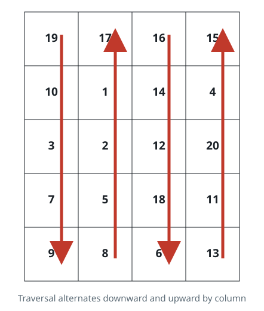

# Zigzag Column Fill

## Description

Extend the array type with a `zigzagColumns(rowsCount, colsCount)` method
that reshapes the one-dimensional array into a `rowsCount x colsCount`
matrix arranged in alternating-column order. When the requested shape does
not fit the data — that is, `rowsCount * colsCount` differs from the
array's length — the input is invalid and the method returns an empty
array.

The arrangement works column by column. The first element of the array
occupies the top-left cell, and the first column fills downward. The next
column then fills upward from its bottom cell to its top cell, and every
following column keeps alternating between downward and upward until every
element has been placed. Reading the finished matrix along those same
directions reproduces the original array exactly. For the input array
[19, 10, 3, 7, 9, 8, 5, 2, 1, 17, 16, 14, 12, 18, 6, 13, 11, 20, 4, 15]
with rowsCount = 5 and colsCount = 4, the resulting matrix appears below;
following the arrows walks the matrix in the same order the values appear
in the source array.



**Note (OpenOJ):** this problem is offered in JavaScript and TypeScript
only. Your submission still enhances `Array` as described — add
`zigzagColumns(rowsCount, colsCount)` to `Array.prototype` (TypeScript
merges the method into the global `Array` interface) implementing exactly
the alternating-column placement above, with an invalid shape returning
`[]`. The judged surface is a plain function call: your source also
declares `zigzagColumns(nums, rowsCount, colsCount)` whose body invokes the
newly enhanced array (`nums.zigzagColumns(rowsCount, colsCount)`), so the
judge's typed arguments pass through the same enhancement.

### Example 1

```text
Input:
nums = [19, 10, 3, 7, 9, 8, 5, 2, 1, 17, 16, 14, 12, 18, 6, 13, 11, 20, 4, 15]
rowsCount = 5
colsCount = 4
Output:
[
 [19,17,16,15],
 [10,1,14,4],
 [3,2,12,20],
 [7,5,18,11],
 [9,8,6,13]
]
```

### Example 2

```text
Input:
nums = [8,3,6,1,9,2]
rowsCount = 2
colsCount = 3
Output: [[8, 1, 9], [3, 6, 2]]
Explanation: The first column fills downward with 8 and 3, the second fills
upward with 6 and 1, and the third fills downward again with 9 and 2.
```

### Example 3

```text
Input:
nums = [5,7,9]
rowsCount = 2
colsCount = 3
Output: []
Explanation: The shape needs 2 * 3 = 6 values, but the array holds only 3,
so the input is invalid and the result is empty.
```

### Constraints

- `0 <= nums.length <= 250`
- `1 <= nums[i] <= 1000`
- `1 <= rowsCount <= 250`
- `1 <= colsCount <= 250`

## Hints

### Hint 1

Track which column you are filling and which way that column is headed.
Whenever the walk runs off the top or bottom edge, flip the direction and
step to the next column.

### Hint 2

Can you place each element directly with arithmetic instead of keeping any
running state?
