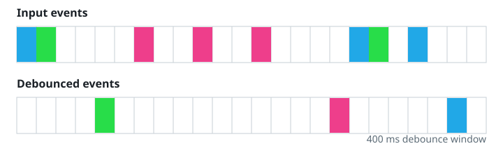

# Waiting For The Calls To Settle

## Description

Given a function `fn` and a quiet window of `t` milliseconds, build the
wrapper that lets a burst of calls resolve to a single execution: each call
to the wrapper reschedules `fn` to run `t` milliseconds later, so `fn`
finally executes only after a full window has passed with no new call —
and it receives the arguments of whichever call turned out to be the last
one.

Concretely: a call arriving at time `x` schedules `fn` for `x + t`; any
further call before that deadline throws the pending schedule away and
starts a fresh one. Calls that land in a burst therefore execute once, at
`last call's time + t`, with the last call's arguments — calls at least `t`
apart each get their own execution.



**Note (OpenOJ):** this problem is offered in JavaScript and TypeScript
only. It is also judged on a deterministic virtual clock rather than real
timers: your submission declares `function settleCalls(fn, t)` plus a class
`Solution` whose `run` method hands your function to the bundle-provided
driver: `quietWindowCase.drive(settleCalls)`. During `drive` the driver
swaps the global `setTimeout`/`clearTimeout` for virtual-clock
equivalents — it replays the case's calls at their recorded times in
order, runs any timer whose deadline arrives before the next call (earlier
deadlines first, exactly as Node drains its timer queue), then drains every
surviving timer to the end. Each actual execution of your wrapped `fn`
records one output row `{"t": <virtual execution time>, "inputs": [...]}`;
that transcript, in execution order, is the judged answer shown below.
Never bypass the timers (no setImmediate, no synchronous invocation) — only
executions scheduled through setTimeout/clearTimeout count.

### Example 1

```text
Input:
t = 100
calls = [
  {"t": 10, "inputs": [4]},
  {"t": 60, "inputs": [7]},
  {"t": 200, "inputs": [9]}
]
Output: [{"t": 160, "inputs": [7]}, {"t": 300, "inputs": [9]}]
Explanation:
The call at 10ms is cancelled by the call at 60ms, which reschedules for
160ms and survives — nothing new arrives before then, so `fn` runs there
with (7). The call at 200ms is far past the first execution; it runs at
300ms with (9).
```

### Example 2

```text
Input:
t = 30
calls = [
  {"t": 5, "inputs": [1, 2]},
  {"t": 100, "inputs": [3]}
]
Output: [{"t": 35, "inputs": [1, 2]}, {"t": 130, "inputs": [3]}]
Explanation:
The two calls are 95ms apart, well beyond the window, so each is honoured
on its own schedule: one at 35ms with (1, 2), the other at 130ms with (3).
```

### Example 3

```text
Input:
t = 40
calls = [
  {"t": 80, "inputs": [1]},
  {"t": 80, "inputs": [2]},
  {"t": 80, "inputs": [3]}
]
Output: [{"t": 120, "inputs": [3]}]
Explanation:
All three calls land at the same instant, so the first two schedules are
thrown away before anything can fire and only the last call's schedule
survives: one execution at 80 + 40 = 120ms with (3).
```

### Constraints

- `0 <= t <= 1000`
- `1 <= calls.length <= 10`
- `0 <= calls[i].t <= 1000`
- `0 <= calls[i].inputs.length <= 10`

## Hints

### Hint 1

`ref = setTimeout(fn, delay)` schedules delayed code; `clearTimeout(ref)`
takes it back before it fires.

### Hint 2

Every wrapper call should first cancel whatever schedule is pending, then
hang a fresh one `t` milliseconds out, carrying the newest arguments.
