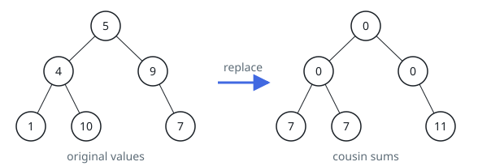
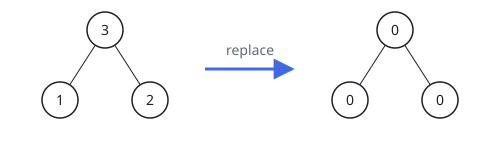

# Cousin Totals in Binary Trees II

## Description

Given the `root` of a binary tree, overwrite every node's value with the
sum of the values of its cousins.

Two nodes count as cousins when they sit at the same depth but have
different parents.

Return the `root` of the rewritten tree.

Here a node's depth means the number of edges on the path from the root
down to it.

### Example 1



```text
Input: root = [5,4,9,1,10,null,7]
Output: [0,0,0,7,7,null,11]
Explanation: The diagram above shows the binary tree before and after each value is replaced.
- The node holding 5 has no cousins, so it becomes 0.
- The node holding 4 has no cousins, so it becomes 0.
- The node holding 9 has no cousins, so it becomes 0.
- The node holding 1 cousins the node holding 7, so it becomes 7.
- The node holding 10 cousins the node holding 7, so it becomes 7.
- The node holding 7 cousins the nodes holding 1 and 10, so it becomes 11.
```

### Example 2



```text
Input: root = [3,1,2]
Output: [0,0,0]
Explanation: The diagram above shows the binary tree before and after each value is replaced.
- The node holding 3 has no cousins, so it becomes 0.
- The node holding 1 has no cousins — the node holding 2 is its sibling, not its cousin — so it becomes 0.
- The node holding 2 likewise has no cousins, so it becomes 0.
```

### Example 3

```text
Input: root = [7,3,8,2,null,5]
Output: [0,0,0,5,null,2]
Explanation: Nodes 3 and 8 are siblings, so neither has a cousin at depth
1 and both become 0. At depth 2, node 2 and node 5 hang off different
parents, so node 2 takes 5's value and node 5 takes 2's value.
```

### Constraints

- The tree contains between `1` and `10⁵` nodes.
- `1 <= Node.val <= 10⁴`

## Hints

### Hint 1

A two-pass depth-first traversal is enough.

### Hint 2

On the first pass, total up the values on every depth level of the tree.

### Hint 3

On the second pass, a node's new value is its level's total minus the
values of the node itself and its sibling.
