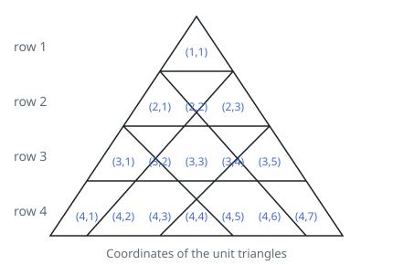
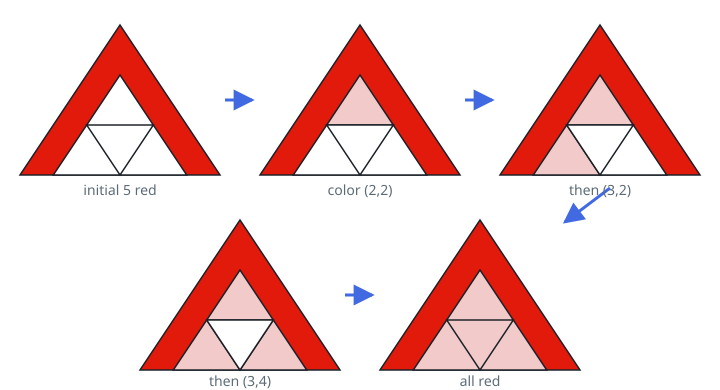
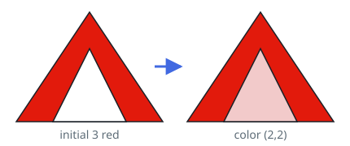

# Fewest Seeds to Redden the Triangle

## Description

You are given an integer `n`. Picture an equilateral triangle whose side
has length `n`; it splits into `n²` tiny unit triangles arranged in `n`
rows, numbered from `1` starting at the top. Row `i` holds `2i - 1` unit
triangles, identified by coordinates `(i, 1)` through `(i, 2i - 1)`.



Call two unit triangles neighbors when they share a full side. To make
that concrete:

- `(1,1)` and `(2,2)` are neighbors.
- `(3,2)` and `(3,3)` are neighbors.
- `(2,2)` and `(3,3)` are not, because no side belongs to both of them.

Every unit triangle starts out white. You pick `k` of them and paint
them red up front. After that, the following procedure runs:

1. Find a white triangle that touches at least two red neighbors.
2. If no such triangle exists, the procedure ends.
3. Paint that triangle red.
4. Return to step 1.

Choose `k` as small as possible and paint exactly `k` triangles red
beforehand, so that by the time the procedure ends every unit triangle
has turned red.

Return the coordinates of the triangles you painted initially, as a 2D
list. Your list must be as short as possible; when several minimum
answers exist, any one of them is accepted.

### Example 1



```text
Input: n = 3
Output: [[1,1],[2,1],[2,3],[3,1],[3,5]]
Explanation: The 5 triangles marked in the figure are painted red
first. The procedure then runs:
- (2,2) already touches three red triangles, so it turns red.
- (3,2) touches two red triangles and turns red.
- (3,4) touches three red triangles and turns red.
- (3,3) touches three red triangles and turns red.
Starting from any 4 triangles instead, the procedure can never recolor
the whole triangle.
```

### Example 2



```text
Input: n = 2
Output: [[1,1],[2,1],[2,3]]
Explanation: The 3 marked triangles are painted red first. Then (2,2),
which touches all three of them, turns red as well. Starting from any 2
triangles instead, the whole triangle can never become red.
```

### Constraints

- `1 <= n <= 1000`

## Hints

### Hint 1

Before building anything, work out how small `k` can possibly be: find
a quantity that the recoloring step can only ever increase by a bounded
amount, and use it as a floor on the number of seeds.

### Hint 2

Construct the answer four rows at a time, working upward from the base.
