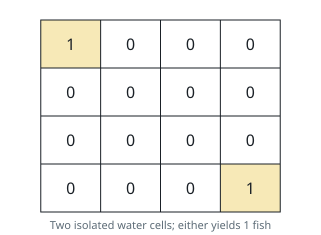

# Richest Connected Waters

## Description

You are given an `m x n` grid. A cell holding `0` is land; a cell
holding a positive number is water stocked with exactly that many fish.

Casting from any water cell, you may then act as many times as you
like: scoop up all the fish in your current cell, or step through an
edge — up, down, left, or right — into an adjacent water cell. Land can
never be crossed.

Choose the starting cell that yields the largest possible total haul
and return it; if the grid holds no water at all, the haul is `0`.

### Example 1


```text
Input: grid = [[0,2,1,0],[4,0,0,3],[1,0,0,4],[0,3,2,0]]
Output: 7
Explanation: Starting in the water at (1,3) scoops 3 fish, and one step
down to (2,3) adds 4 more, for a total of 7. No other water region in
this grid adds up to more.
```

### Example 2



```text
Input: grid = [[1,0,0,0],[0,0,0,0],[0,0,0,0],[0,0,0,1]]
Output: 1
Explanation: The two water cells sit alone in opposite corners with no
water neighbor, so the best anyone can do is catch a single fish.
```

### Constraints

- `m == grid.length`
- `n == grid[i].length`
- `1 <= m, n <= 10`
- `0 <= grid[i][j] <= 10`

## Hints

### Hint 1

Think of the water cells as the nodes of a graph, with an edge between
two of them whenever the cells share a side.

### Hint 2

One sweep from any untouched water cell reaches exactly one connected
region; add up the fish along the way and keep the best region total.
