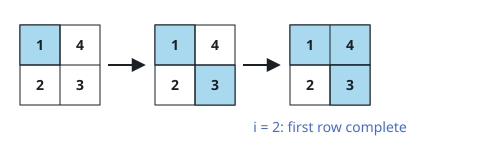
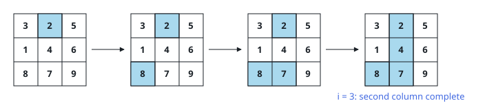

# First Line to Fill

## Description

You are given an integer array `arr` and an `m x n` integer matrix
`mat`. Between them, `arr` and `mat` each contain every integer in the
range `[1, m * n]` exactly once.

Walk `arr` from front to back. At step `i` you paint the cell of `mat`
that holds the value `arr[i]`.

Report the earliest step `i` by which some full row or some full column
of `mat` has been painted — that is, the first moment any line of the
matrix has every one of its cells colored.

### Example 1



```text
Input: arr = [1,3,4,2], mat = [[1,4],[2,3]]
Output: 2
Explanation: The frames show the cells in painting order. When
arr[2] = 4 lands, the top row and the right column fill at the same
instant — the first completed lines of the run.
```

### Example 2



```text
Input: arr = [2,8,7,4,1,3,5,6,9], mat = [[3,2,5],[1,4,6],[8,7,9]]
Output: 3
Explanation: The middle column gains 2, then 7, then 4, completing at
arr[3] ahead of every other line.
```

### Constraints

- `m == mat.length`
- `n == mat[i].length`
- `arr.length == m * n`
- `1 <= m, n <= 10⁵`
- `1 <= m * n <= 10⁵`
- `1 <= arr[i], mat[r][c] <= m * n`
- Every integer in `arr` is unique.
- Every integer in `mat` is unique.

## Hints

### Hint 1

A counting array indexed by value can answer "where does this value
live?" in constant time.

### Hint 2

Record every value's matrix position before the walk starts.

### Hint 3

Replay `arr` through those positions, bumping a counter for the painted
cell's row and another for its column.

### Hint 4

The first time a row counter hits `n` or a column counter hits `m`,
that step of the walk is the answer.
