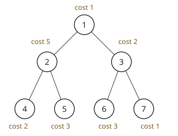
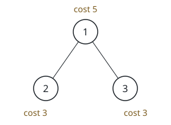

# Balancing Root-to-Leaf Costs

## Description

Picture a perfect binary tree whose nodes carry the labels `1` through `n`:
label `1` marks the root, and each internal node `i` has `2 * i` as its left
child and `2 * i + 1` as its right child.

A 0-indexed array `cost` of length `n` supplies the price of standing on
each node — node `x` costs `cost[x - 1]`. You may repeatedly pick any single
node and raise its cost by 1.

Find the fewest such raises needed so that every path from the root down to
a leaf carries the same total, where a path's total is the sum of its
nodes' costs.

Note:

- A binary tree is perfect when every non-leaf node has exactly two
  children.
- The total of a path is computed by adding up the costs of all of its
  nodes.

### Example 1



```text
Input: n = 7, cost = [1,5,2,2,3,3,1]
Output: 6
Explanation: Three raises settle it: add 1 to node 4, add 3 to node 3, and
add 2 to node 7 — a total of 1 + 3 + 2 = 6 raises. Afterwards every
root-to-leaf path sums to 9, and no smaller number of raises manages to
level all four paths.
```

### Example 2



```text
Input: n = 3, cost = [5,3,3]
Output: 0
Explanation: Both root-to-leaf paths already sum to the same value, so the
tree needs no work at all.
```

### Constraints

- `3 <= n <= 10⁵`
- `n + 1` is a power of 2
- `cost.length == n`
- `1 <= cost[i] <= 10⁴`

## Hints

### Hint 1

One root-to-leaf path already costs the most of any; spending a raise
anywhere along it can never help, so its total is the level to aim for.

### Hint 2

The efficient plan lifts every other path up to that maximum, paying each
required amount as low in the tree as possible — the gap between two
siblings only ever needs to be paid once, at their parent.
