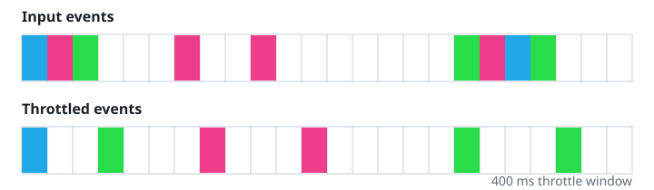

# Pacing The Calls

## Description

Given a function `fn` and a duration `t` in milliseconds, wrap `fn` in a
paced version of itself.

The paced wrapper lets the first call straight through and then holds
the door shut for `t` milliseconds. Calls that arrive while the door is
shut do not run; they only overwrite a held slot with their arguments.
The moment the hold expires, the latest saved arguments run through `fn`,
and the door shuts again for another `t` milliseconds from that instant.

Concretely, take `t = 50` with calls arriving at 30ms, 40ms, and 60ms.
The 30ms call runs immediately and blocks everything until 80ms. The
40ms call only saves its arguments. The 60ms call overwrites them, since
it also lands before 80ms. When 80ms arrives, `fn` runs once with the
60ms call's arguments, and a new hold stretches to 130ms.



**Note (OpenOJ):** this problem is offered in JavaScript and TypeScript
only. It is also judged on a deterministic virtual clock rather than
real timers: your submission declares `function paceCalls(fn, t)` plus a
`class Solution` whose `run` method hands your function to the
bundle-provided driver: `paceProbe.drive(paceCalls)`. During `drive` the
driver swaps the global `setTimeout`/`clearTimeout` for virtual-clock
equivalents — it replays the case's calls at their recorded times in
order, flushing any timer whose deadline has been reached before each
call proceeds (earlier deadlines first, exactly as Node drains its timer
queue), then runs every surviving timer to completion. Each actual
execution of your wrapped `fn` records one output row
`{"t": <virtual execution time>, "inputs": [...]}` in execution order;
that recorded transcript is the judged answer shown as `Output` below.
Never bypass the timers (no setImmediate or synchronous calls) — only
executions scheduled through setTimeout/clearTimeout count.

### Example 1

```text
Input:
t = 60,
calls = [
  {"t":10,"inputs":[3]}
]
Output: [{"t":10,"inputs":[3]}]
Explanation: A lone call always passes through on the spot.
```

### Example 2

```text
Input:
t = 40,
calls = [
  {"t":15,"inputs":[2]},
  {"t":30,"inputs":[6]}
]
Output: [{"t":15,"inputs":[2]},{"t":55,"inputs":[6]}]
Explanation: The first call runs at 15ms and holds until 15 + 40 = 55ms.
The second call lands at 30ms, inside the hold, so its arguments are only
saved — and they run when the hold expires at 55ms.
```

### Example 3

```text
Input:
t = 80,
calls = [
  {"t":20,"inputs":[1]},
  {"t":95,"inputs":[]},
  {"t":150,"inputs":[2,9]},
  {"t":400,"inputs":[8]}
]
Output: [{"t":20,"inputs":[1]},{"t":100,"inputs":[]},{"t":180,"inputs":[2,9]},{"t":400,"inputs":[8]}]
Explanation: The first call runs at 20ms and holds until 100ms. The call
at 95ms saves an empty argument list — which is still a saved value, so
at 100ms `fn` runs with no arguments and the hold extends to 180ms. The
call at 150ms saves [2,9], which runs at 180ms and holds until 260ms.
The last call arrives at 400ms, well past 260ms, so it runs on the spot.
```

### Constraints

- `0 <= t <= 1000`
- `1 <= calls.length <= 10`
- `0 <= calls[i].t <= 1000`
- `0 <= calls[i].inputs[j], calls[i].inputs.length <= 10`

## Hints

### Hint 1

Keep one slot for the latest arguments that landed during a hold.

### Hint 2

With no hold open, run `fn` immediately and open one by scheduling a
timer for `t`. With a hold open, just write the new arguments into the
slot.

### Hint 3

When the timer fires: an untouched slot means stay quiet; otherwise run
`fn` with the slot's arguments and schedule the next `t` timer from now.
