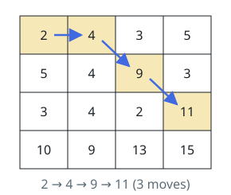
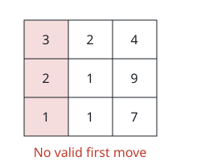

# Longest Ascent Across A Grid

## Description

You are given a `grid` of positive integers with `m` rows and `n` columns,
indexed from zero.

Pick any starting cell in the first column and walk across the grid. Each
step leaves cell (row, col) and lands on (row - 1, col + 1), (row, col + 1),
or (row + 1, col + 1), and it is legal only when the landing cell holds a
strictly greater value than the cell being left.

A walk ends when no legal step exists from wherever it stands. Return the
largest number of steps any such walk can take.

### Example 1



```text
Input: grid = [[2,4,3,5],[5,4,9,3],[3,4,2,11],[10,9,13,15]]
Output: 3
Explanation: Begin at cell (0, 0) and climb as the figure shows:
- (0, 0) -> (0, 1).
- (0, 1) -> (1, 2).
- (1, 2) -> (2, 3).
The values along the way rise 2 -> 4 -> 9 -> 11, and nothing longer is
achievable, so the answer is 3.
```

### Example 2



```text
Input: grid = [[3,2,4],[2,1,9],[1,1,7]]
Output: 0
Explanation: From (0, 0) the rightward neighbors hold 2 and 1, from
(1, 0) they hold 2, 1 and 1, and from (2, 0) they hold 1 and 1 — never
strictly larger than the current cell. As the figure marks, no first
step exists and the answer is 0.
```

### Constraints

- `m == grid.length`
- `n == grid[i].length`
- `2 <= m, n <= 1000`
- `4 <= m * n <= 10⁵`
- `1 <= grid[i][j] <= 10⁶`

## Hints

### Hint 1

Treat the grid column by column: a cell is reachable if some walk from the
first column can end there, and the set of reachable cells in one column is
determined entirely by the reachable set in the column before it.

### Hint 2

Sweeping left to right while keeping only the current reachable set turns
this into dynamic programming with a single boolean array; the answer is
how many times that set successfully advances before it empties.
