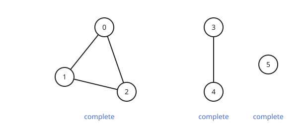
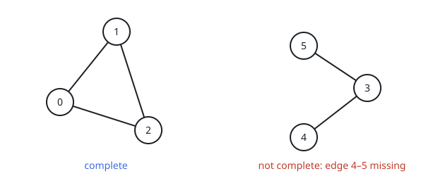

# Fully Wired Cliques

## Description

An undirected graph has `n` vertices numbered `0` through `n - 1`, and a
2D integer array `edges` describes its wiring: `edges[i] = [ai, bi]` means
vertices `ai` and `bi` are joined by an undirected edge.

The graph falls into connected components — maximal groups of vertices in
which every pair is linked by some path, and no member of the group shares
an edge with a vertex outside it. Count how many of these components are
**fully wired**: every two vertices of the component are joined directly
by an edge.

Return that count.

### Example 1



```text
Input: n = 6, edges = [[0,1],[0,2],[1,2],[3,4]]
Output: 3
Explanation: As the picture shows, the graph splits into the components
{0, 1, 2}, {3, 4} and {5}, and each of the three is fully wired.
```

### Example 2



```text
Input: n = 6, edges = [[0,1],[0,2],[1,2],[3,4],[3,5]]
Output: 1
Explanation: The component {0, 1, 2} carries all three of its possible
edges. The component {3, 4, 5} falls short — vertices 4 and 5 share no
edge, as the picture marks — so only one component qualifies.
```

### Constraints

- `1 <= n <= 50`
- `0 <= edges.length <= n * (n - 1) / 2`
- `edges[i].length == 2`
- `0 <= ai, bi <= n - 1`
- `ai != bi`
- No edge appears more than once.

## Hints

### Hint 1

Start by partitioning the vertices into their connected components;
depth-first search, breadth-first search, and union-find all get there.

### Hint 2

For each component, tally two numbers: how many vertices it holds and how
many edges it carries.

### Hint 3

A component with `m` vertices is fully wired exactly when it carries all
`m * (m - 1) / 2` of its possible edges — that many distinct edges leave
no pair unconnected.
