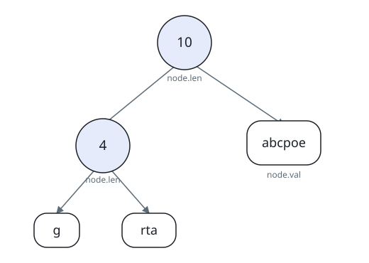
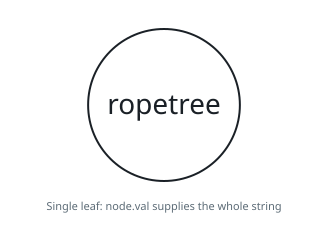

# Plucking A Letter From The Rope Tree

## Description

You are given the root of a binary tree. Besides its left and right
children, every node carries a string `node.val` of lowercase English
letters (possibly empty) and a non-negative integer `node.len`. Two kinds
of nodes exist:

- Leaf — has no children, `node.len = 0`, and a non-empty `node.val`.
- Internal — has one or two children, `node.len > 0`, and an empty
  `node.val`.

This shape is known as a rope binary tree: each node spells out a
substring `S[node]`, defined recursively:

- for a leaf, `S[node] = node.val`;
- for an internal node, `S[node] = concat(S[node.left], S[node.right])`,
  and `node.len` is that substring's length.

Return the k-th character of the string `S[root]`.

Note: `concat(s, p)` appends `p` to `s`; for instance,
`concat("ab", "zz") = "abzz"`.

The tree arrives serialized in level order as the string array `root`: the
first entry describes the root, and every internal node is followed, in
order, by the entries for its children — up to two, left before right —
where an empty entry marks an absent child and absent children at the end
are omitted. An entry of decimal digits stands for an internal node and
carries its `node.len`; an entry of lowercase letters stands for a leaf
and carries its `node.val`.

### Example 1

```text
Input: root = ["10","4","abcpoe","g","rta"], k = 6
Output: "b"
Explanation: As the figure draws, internal nodes wear their `node.len`
integers and leaves wear their `node.val` strings. The root's left
subtree spells concat("g", "rta") = "grta" and its right subtree spells
"abcpoe", so S[root] = "grtaabcpoe", whose 6th character is "b".
```



### Example 2

```text
Input: root = ["12","6","6","abc","efg","hij","klm"], k = 3
Output: "c"
Explanation: The figure shows both levels splitting in two, so
S[root] = concat(concat("abc", "efg"), concat("hij", "klm")) =
"abcefghijklm". Its 3rd character is "c".
```


### Example 3

```text
Input: root = ["ropetree"], k = 8
Output: "e"
Explanation: A lone leaf is its own rope — the figure shows the single
node — so S[root] = "ropetree" and the 8th character is "e".
```



### Constraints

- The number of nodes in the tree is in the range `[1, 10³]`
- `node.val` contains only lowercase English letters
- `0 <= node.val.length <= 50`
- `0 <= node.len <= 10⁴`
- a leaf has `node.len = 0` and a non-empty `node.val`
- an internal node has `node.len > 0` and an empty `node.val`
- `1 <= k <= S[root].length`

## Hints

### Hint 1

Recursion suits this structure.

### Hint 2

Compose a recursive routine that takes a node and returns the substring
`S[node]`.

### Hint 3

Invoke it on the root, then read off the k-th character of the answer.
