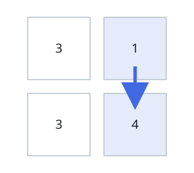
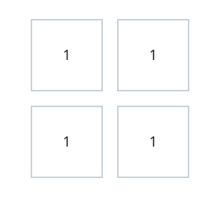
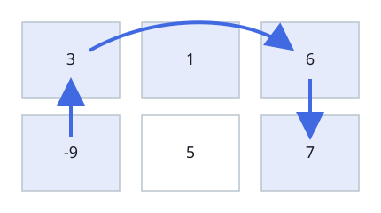

# Longest Grid Climb

## Description

Take a 1-indexed `m x n` matrix of integers `mat` and begin at any cell you
like. From the current cell you may jump to any other cell sharing its row
or its column, provided the destination's value is strictly larger. Jumps
continue for as long as such a destination exists.

How many cells can a single journey touch at most? Return that maximum,
counting the starting cell.

### Example 1



```text
Input: mat = [[3,1],[3,4]]
Output: 2
Explanation: The image traces a two-cell journey that begins at row 1,
column 2 and climbs to the strictly larger 4 in the bottom-right. No
starting cell supports a longer journey, so the answer is 2.
```

### Example 2



```text
Input: mat = [[1,1],[1,1]]
Output: 1
Explanation: Every value is equal, and equal values cannot be climbed, so
any journey consists of its starting cell alone.
```

### Example 3



```text
Input: mat = [[3,1,6],[-9,5,7]]
Output: 4
Explanation: The image traces a four-cell journey beginning at row 2,
column 1. It can be shown that no start yields more than 4 cells, so the
answer is 4.
```

### Constraints

- `m == mat.length`
- `n == mat[i].length`
- `1 <= m, n <= 10^5`
- `1 <= m * n <= 10^5`
- `-10^5 <= mat[i][j] <= 10^5`

## Hints

### Hint 1

Work bottom-up: settle the smallest values first and let larger values
build on them.

### Hint 2

Sweep the values in sorted order while remembering, for every row and
every column, the longest journey that already ends there among smaller
values.

### Hint 3

A cell simply extends the better of its row's and column's remembered
lengths by one, and equal-valued cells must all be settled before any of
their lengths are written back.
