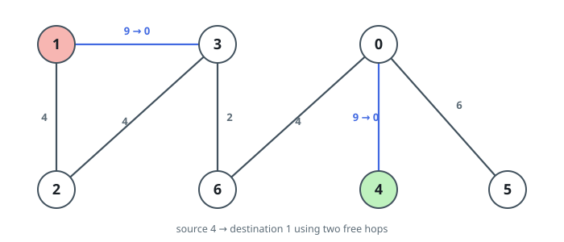
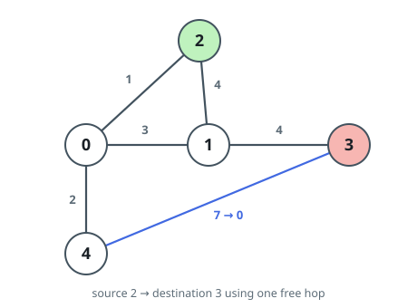

# Cheapest Route with Free Hops

## Description

A connected undirected graph has `n` nodes, numbered from `0`. Its roads
come as a 0-indexed array `edges`, where `edges[i] = [ui, vi, wi]` means
nodes `ui` and `vi` are joined by an edge of weight `wi`.

You must travel from node `s` to node `d`, but you hold a perk: at most `k`
times, you may cross an edge without paying — as if its weight were `0`.
Every other edge adds its full weight. Return the smallest possible total
length of such a journey.

### Example 1


```text
Input: n = 4, edges = [[0,1,4],[0,2,2],[2,3,6]], s = 1, d = 3, k = 2
Output: 2
Explanation: The graph offers a single route from the green node 1 to the
red node 3, running 1->0->2->3 for a cost of 4 + 2 + 6 = 12. Spending both
free hops on the blue edges leaves only the middle edge to pay:
0 + 2 + 0 = 2. No journey can do better.
```

### Example 2



```text
Input: n = 7, edges = [[3,1,9],[3,2,4],[4,0,9],[0,5,6],[3,6,2],[6,0,4],[1,2,4]], s = 4, d = 1, k = 2
Output: 6
Explanation: From the green node 4 to the red node 1 there are two routes:
4->0->6->3->2->1 costs 9 + 4 + 2 + 4 + 4 = 23, and 4->0->6->3->1 costs
9 + 4 + 2 + 9 = 24. Taking the second and waiving the blue edges — the two
9-weight roads — the trip costs 0 + 4 + 2 + 0 = 6, which is optimal.
```

### Example 3



```text
Input: n = 5, edges = [[0,4,2],[0,1,3],[0,2,1],[2,1,4],[1,3,4],[3,4,7]], s = 2, d = 3, k = 1
Output: 3
Explanation: Four routes lead from the green node 2 to the red node 3:
2->1->3 costs 4 + 4 = 8, 2->0->1->3 costs 1 + 3 + 4 = 8,
2->1->0->4->3 costs 4 + 3 + 2 + 7 = 16, and 2->0->4->3 costs 1 + 2 + 7 =
10. The single free hop is best spent on the blue edge 3-4 of that last
route, giving 1 + 2 + 0 = 3 — cheaper than any discount the shorter routes
could offer.
```

### Constraints

- `2 <= n <= 500`
- `n - 1 <= edges.length <= min(10^4, n * (n - 1) / 2)`
- `edges[i].length == 3`
- `0 <= edges[i][0], edges[i][1] <= n - 1`
- `1 <= edges[i][2] <= 10^6`
- `0 <= s, d, k <= n - 1`
- `s != d`
- The input graph is connected and contains no repeated edges and no
  self-loops.

## Hints

### Hint 1

Build a bigger search space in your head and run Dijkstra over it.

### Hint 2

Let a state be a pair `(v, c)`: node `v` of the input graph together with
a counter `c` between `0` and `k` recording how many free crossings have
been used.

### Hint 3

Design the transitions so that running Dijkstra from `(s, 0)` makes the
distance of `(d, anything)` the final answer.

### Hint 4

Paid transition: for every input edge `(v, u, w)` and every counter value
`c`, connect `(v, c)` and `(u, c)` with an edge of weight `w`.

### Hint 5

Free transition: for every input edge `(v, u, w)` and every `c` below `k`,
connect `(v, c)` to `(u, c + 1)` — and `(u, c)` to `(v, c + 1)` — with
weight `0`.

### Hint 6

For speed, note that the layered graph never has to be built literally;
relax both transition kinds straight off the original adjacency lists.
