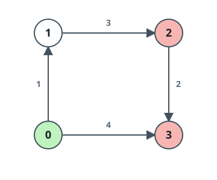
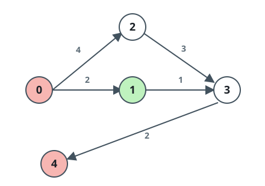
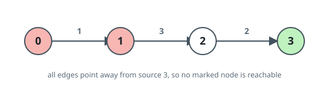

# Nearest Flagged Node

## Description

You are given a directed weighted graph on `n` nodes numbered `0` to
`n - 1`, supplied as a 2D array `edges` where
`edges[i] = [uᵢ, vᵢ, wᵢ]` is a one-way hop from `uᵢ` to `vᵢ` costing
`wᵢ`.

You are also given a starting node `s` and a list `marked` of target
nodes. Find the cheapest trip that starts at `s` and ends at any one
of the marked nodes.

Return that smallest total cost, or `-1` if no marked node can be
reached from `s`.

### Example 1



```text
Input: n = 4, edges = [[0,1,1],[1,2,3],[2,3,2],[0,3,4]], s = 0, marked = [2,3]
Output: 4
Explanation: From the green node 0, marked node 2 (red) is reached
only by 0->1->2, for a cost of 1 + 3 = 4. Node 3 (red) is reached two
ways: 0->1->2->3 costing 1 + 3 + 2 = 6, or the direct edge 0->3
costing 4. The cheapest arrival at any marked node is 4.
```

### Example 2



```text
Input: n = 5, edges = [[0,1,2],[0,2,4],[1,3,1],[2,3,3],[3,4,2]], s = 1, marked = [0,4]
Output: 3
Explanation: Marked node 0 (red) cannot be reached from the green
node 1 at all. Marked node 4 (red) is reached by 1->3->4, costing
1 + 2 = 3, so that is the answer.
```

### Example 3



```text
Input: n = 4, edges = [[0,1,1],[1,2,3],[2,3,2]], s = 3, marked = [0,1]
Output: -1
Explanation: Every edge points away from the green node 3 and none
leads back to either red node, so no marked node is reachable and the
answer is -1.
```

### Constraints

- `2 <= n <= 500`
- `1 <= edges.length <= 10⁴`
- `edges[i].length == 3`
- `0 <= edges[i][0], edges[i][1] <= n - 1`
- `1 <= edges[i][2] <= 10⁶`
- `1 <= marked.length <= n - 1`
- `0 <= s, marked[i] <= n - 1`
- `s != marked[i]`
- `marked[i] != marked[j]` for every `i != j`
- The same edge may appear more than once.
- No edge runs from a node back to itself.

## Hints

### Hint 1

Start by computing the distance from `s` to every node in the graph.

### Hint 2

All weights are positive, so one pass of Dijkstra with a min-heap
settles every distance.

### Hint 3

The answer is the smallest settled distance among the marked nodes.
Skip marked nodes that were never reached; if none remain, the answer
is -1.
