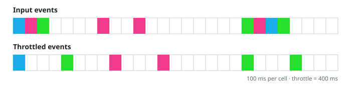

# Coalescing Key Lookups

## Description

Fetching one key at a time wastes a round trip per key. Write a class
`LookupCoalescer` that folds lookups arriving close together into shared
batch calls.

The constructor takes two parameters:

- `queryMultiple`, an asynchronous function that accepts an array of
  string keys and resolves with an array of values of the same length,
  index for index: the value at index `i` belongs to key `input[i]`. It
  never rejects.
- `t`, a throttle window in milliseconds.

The class exposes one method:

- `async getValue(key)` — accepts a single string key and resolves with
  that key's single string value. Every key handed here must eventually
  reach `queryMultiple`, and two consecutive `queryMultiple` calls must
  never be less than `t` milliseconds apart. The very first `getValue`
  dispatches `queryMultiple` immediately with just that key; when a
  `getValue` lands within `t` milliseconds of a dispatch, its key joins
  the batch in flight's window, and all such keys travel in one
  `queryMultiple` call whose values fan back out to each caller. Every
  key arriving at this method is unique.

The diagram below traces one timeline on a grid whose cells each stand
for 100 ms, with a throttle window of 400 ms: events arriving inside one
window share a single throttled dispatch.



**Note (OpenOJ):** this problem is offered in JavaScript and TypeScript
only, and it is judged on a deterministic virtual clock instead of real
timers. Your entry point is a class `Solution` with `run(driver)`, where
the provided `driver` exposes:

- `driver.queryMultiple(keys)` — the asynchronous function your
  coalescer must call; on the virtual clock it resolves with
  `keys.map(key => key + "!")` after its per-case delay.
- `driver.t` — the throttle window in milliseconds.
- `driver.clock` — the virtual clock: `clock.now()` returns the current
  virtual millisecond, and `clock.setTimeout(callback, delay)` schedules
  `callback` once, `delay` virtual milliseconds from now. Timers due at
  the same tick fire in scheduling order. Never touch global timer
  functions.
- `driver.drive(coalescer)` — schedules every timeline call of the case
  and runs the whole simulation synchronously.

Construct `new LookupCoalescer(driver.queryMultiple, driver.t,
driver.clock)` and hand it to `driver.drive`; the judge reads back every
resolution as `{"resolved": value, "time": virtualMs}` in resolution
order.

Anchoring rule: let `C` be the virtual time of the most recent
`queryMultiple` call. A `getValue(key)` arriving at time `w` starts a
fresh immediate single-key batch when `w - C >= t` (and then `C := w`);
otherwise the key joins the pending batch, which is dispatched exactly
once at time `C + t` (and then `C := C + t`). Consecutive
`queryMultiple` calls are therefore always at least `t` milliseconds
apart, measured call to call.

### Example 1

```text
Input:
queryMultiple resolves as soon as it is called
t = 50
calls = [
 {"key": "x", "time": 5},
 {"key": "y", "time": 30}
]
Output: [
 {"resolved": "x!", "time": 5},
 {"resolved": "y!", "time": 55}
]
Explanation:
At t=5ms, getValue('x') opens the first window and queryMultiple(['x'])
runs at once, so "x!" lands at t=5ms.
At t=30ms, getValue('y') lands 25ms into that window, so it queues.
The window closes at t=55ms and queryMultiple(['y']) dispatches, so
"y!" lands at t=55ms.
```

### Example 2

```text
Input:
queryMultiple resolves after a fixed 40ms delay
t = 60
calls = [
 {"key": "p", "time": 10},
 {"key": "q", "time": 40},
 {"key": "r", "time": 130}
]
Output: [
 {"resolved": "p!", "time": 50},
 {"resolved": "q!", "time": 110},
 {"resolved": "r!", "time": 170}
]
Explanation:
At t=10ms, queryMultiple(['p']) dispatches immediately and resolves
40ms later at t=50ms.
At t=40ms, getValue('q') is 30ms past the last call — inside the
window — so it queues; the window ends at t=70ms, queryMultiple(['q'])
dispatches, and "q!" resolves at t=110ms.
At t=130ms, exactly 60ms have passed since the t=70ms dispatch, so the
window is closed: queryMultiple(['r']) runs immediately and "r!"
resolves at t=170ms.
```

### Example 3

```text
Input:
queryMultiple resolves after 30ms per key in the batch
t = 100
calls = [
 {"key": "a", "time": 10},
 {"key": "b", "time": 20},
 {"key": "c", "time": 30},
 {"key": "d", "time": 60},
 {"key": "e", "time": 250},
 {"key": "f", "time": 300}
]
Output: [
 {"resolved": "a!", "time": 40},
 {"resolved": "b!", "time": 200},
 {"resolved": "c!", "time": 200},
 {"resolved": "d!", "time": 200},
 {"resolved": "e!", "time": 280},
 {"resolved": "f!", "time": 380}
]
Explanation:
queryMultiple(['a']) runs at t=10ms and resolves at t=40ms.
'b', 'c', and 'd' all land inside the first window, so one
queryMultiple(['b','c','d']) dispatches when it closes at t=110ms and
resolves 90ms later, at t=200ms, for all three.
At t=250ms the last dispatch was 140ms ago, so 'e' opens a fresh
window; queryMultiple(['e']) runs at once and resolves at t=280ms.
At t=300ms, 'f' is 50ms past that call, so it queues; the window ends
at t=350ms, queryMultiple(['f']) dispatches, and "f!" resolves at
t=380ms.
```

### Constraints

- `0 <= t <= 1000`
- `0 <= calls.length <= 10`
- `1 <= key.length <= 100`
- All keys are unique.
