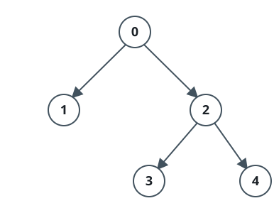
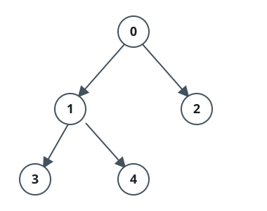

# Telling A Real Preorder From A Fake

## Description

You are handed a 0-indexed 2D array `nodes` describing one binary tree:
entry `i` is `[id, parentId]`, where `id` names the `i`-th node in the
listing and `parentId` is the id of that node's parent (`-1` marks a
node with no parent).

Decide whether the entries are listed in an order that a preorder
traversal of this tree could produce — each node visited before its
left subtree, and the left subtree before the right. Return `true` if
the listing is a preorder and `false` otherwise.

### Example 1



```text
Input: nodes = [[0,-1],[1,0],[2,0],[3,2],[4,2]]
Output: true
Explanation: The records draw the tree shown below. The listing reads
exactly like a walk of it: node 0 first, then the subtree hanging from
1, then the subtree hanging from 2 — which itself continues 2, 3, 4.
```

### Example 2



```text
Input: nodes = [[0,-1],[1,0],[2,0],[3,1],[4,1]]
Output: false
Explanation: The records draw the tree shown below. A preorder that
visits 0 and then 1 must finish 1's entire subtree before moving on,
yet node 2 appears between 1 and 3 — so no binary tree lists itself in
this order.
```

### Constraints

- `1 <= nodes.length <= 10⁵`
- `nodes[i].length == 2`
- `0 <= nodes[i][0] <= 10⁵`
- `-1 <= nodes[i][1] <= 10⁵`
- The input is built so that `nodes` always describes a binary tree.

## Hints

### Hint 1

Replay the listing with a stack instead of building the tree.

### Hint 2

The first record has nothing above it yet — and only a root is allowed
to arrive that way.

### Hint 3

For every later record, pop ids off the stack — each pop closes a
finished subtree — until the current node's parent sits on top. If the
stack runs dry first, that parent's subtree has already been left
behind.

### Hint 4

Every record is pushed once and popped at most once, so the whole
replay stays linear.
