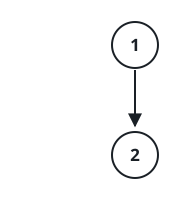
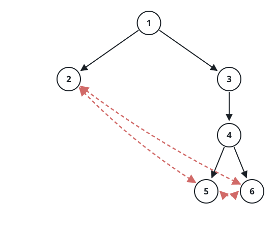

# Measuring The Ringed Tree

## Description

You are handed the `root` of a ringed binary tree with `n` nodes, each
node holding a distinct value from `1` to `n`. Its `k` leaves, read in
increasing value order as `b1 < b2 < ... < bk`, are wired into a ring:

- the right child of `bi` is `bi+1` for `i < k`, and `b1` for the last
  leaf;
- the left child of `bi` is `bi-1` for `i > 1`, and `bk` for the first.

Every leaf therefore ends up with two children — the leaves flanking it
in value order — and a tree with a single leaf has that leaf as its own
left and right child. All other nodes keep their ordinary binary-tree
children.

Report the tree's height: the number of edges on the longest path from
the `root` to any other node.

The ordinary binary tree arrives in level order (the examples show the
encoding); the leaf ring follows from the property above and is wired
into place before your method runs.

### Example 1


```text
Input: root = [1,2,3,null,null,4,5]
Output: 2
Explanation: Reading the leaves by value gives 2, 4, and 5. The dashed
edges in the figure are the ring: each leaf's left pointer lands on the
leaf just below it in value, its right pointer on the one just above.
The deepest route from the root is 1 → 3 → 4, or equally 1 → 3 → 5 —
two edges.
```

### Example 2



```text
Input: root = [1,2]
Output: 1
Explanation: The lone leaf 2 points at itself on both sides. The only
edge leading away from the root is 1 → 2, so the height is 1.
```

### Example 3



```text
Input: root = [1,2,3,null,null,4,null,5,6]
Output: 3
Explanation: The leaves 2, 5, and 6 close into a ring in value order.
The deepest routes are 1 → 3 → 4 → 5 and 1 → 3 → 4 → 6, each three
edges long.
```

### Constraints

- The tree holds between `2` and `10⁴` nodes.
- Every node value is a distinct integer in `[1, n]`.

### Hint 1

Follow the pointers blindly and the walk never comes home: from a leaf,
both `left` and `right` lead sideways to neighboring leaves. The entire
trick is telling leaves apart from internal nodes before taking a step.

### Hint 2

The wiring itself brands the leaves. A leaf's left child is the leaf
just before it in the ring, whose right child points straight back — so
a node `v` is a leaf exactly when `v.left` exists and `v.left.right` is
`v` again. An internal node's left child is a genuine child, and a real
child never points back at its parent.

### Hint 3

With a reliable leaf test, the height falls back to the everyday
definition: a leaf sits at height 0, and every other node sits one above
its taller child.
