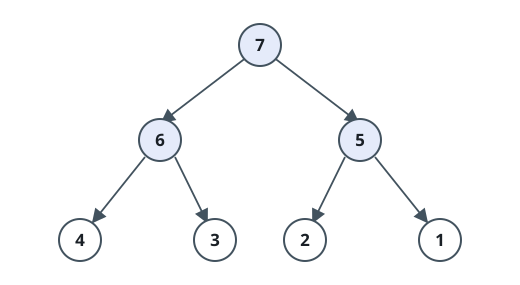
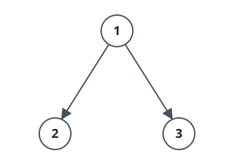
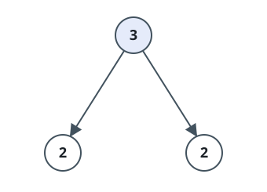

# Counting The Nodes That Outrank K Kin

## Description

You are given the `root` of a binary tree and an integer `k`. Call a
node outranking when both of these hold:

- Its subtree contains at least `k` nodes.
- At least `k` nodes in its subtree carry a strictly smaller value than
  its own.

Count the outranking nodes in the tree.

A node `u` belongs to the subtree of `v` when `u == v` or `v` is an
ancestor of `u`.

### Example 1



```text
Input: root = [7,6,5,4,3,2,1], k = 2
Output: 3
Explanation: Number the nodes 1 through 7 in the diagram.
- Node 1 oversees the whole tree, whose values are {1,2,3,4,5,6,7}: six
  of them sit below 7.
- Node 2 oversees {3,4,6}: two of them sit below 6.
- Node 3 oversees {1,2,5}: two of them sit below 5.
Those three clear the bar of k = 2; every other node falls short of it.
```

### Example 2



```text
Input: root = [1,2,3], k = 1
Output: 0
Explanation: Number the nodes 1 through 3.
- Node 1 oversees {1,2,3}, yet nothing there is smaller than the root's
  own value 1.
- Node 2 and node 3 are leaves, so neither subtree holds even one
  smaller value.
No node outranks k = 1 of its kin.
```

### Example 3



```text
Input: root = [3,2,2], k = 2
Output: 1
Explanation: Number the nodes 1 through 3.
- Node 1 oversees {2,2,3}: both 2s sit below 3, so the root clears
  k = 2.
- Node 2 and node 3 hold only themselves, with nothing smaller beneath.
Only the root qualifies.
```

### Constraints

- The tree holds between `1` and `10⁴` nodes.
- `1 <= Node.val <= 10⁴`
- `1 <= k <= 10`

## Hints

### Hint 1

Track only the `k` smallest values of each subtree — one sorted list of
at most `k` entries carries every fact the test needs.

### Hint 2

Assemble a node's list only after its children's lists exist: pool the
two child lists together with the node's own value, sort, and cut the
pool back down to `k` entries.

### Hint 3

The trimmed list reaches length exactly `k` precisely when the subtree
holds at least `k` nodes; and when it does, the node qualifies exactly
when its value beats the list's final entry.
