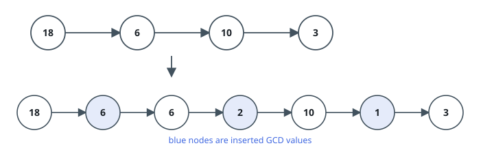
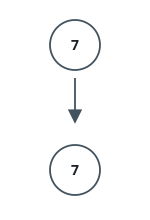

# Splicing GCD Nodes Into A List

## Description

You are handed the `head` of a singly linked list whose every node carries
an integer.

Walk the list and, between each pair of neighboring original nodes, splice
in one fresh node holding the greatest common divisor of that pair's two
values. After the pass, every adjacent pair of original nodes is separated
by exactly one such node, and the original nodes keep their relative order.

Hand back the head of the reworked list.

The greatest common divisor of two numbers is the largest positive integer
that divides both of them.

### Example 1



```text
Input: head = [18,6,10,3]
Output: [18,6,6,2,10,1,3]
Explanation: The first picture shows the list as it arrives; the second
shows it after the splicing pass, with the inserted nodes drawn in blue.
- 18 and 6 share gcd 6, which goes between the first and second nodes.
- 6 and 10 share gcd 2, which goes between the second and third nodes.
- 10 and 3 share gcd 1, which goes between the third and fourth nodes.
No original neighbors remain, so the finished list is returned.
```

### Example 2



```text
Input: head = [7]
Output: [7]
Explanation: The first picture shows the single-node list and the second
shows it after the pass. With no pair of neighbors to separate, the list
comes back untouched.
```

### Constraints

- The list holds between `1` and `5000` nodes.
- `1 <= Node.val <= 1000`
