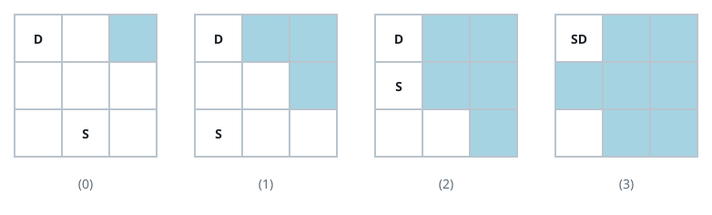

# Outrun The Flood

## Description

Low ground is flooding, and you are trying to stay ahead of the water. The
terrain is an `n * m` grid called `land`, your current position is the cell
containing `"S"`, and the cell you want to reach contains `"D"`. Every other
cell is one of:

- `"."`: open ground;
- `"X"`: a boulder that can never be entered;
- `"*"`: water.

Each second you may move from your cell to one sharing a side with it (when
such a cell exists). The water spreads at the same pace: every open cell
sharing a side with a flooded cell becomes flooded itself.

Two hazards stand in your way:

- boulders cannot be entered at all;
- water is deadly — you may not enter a flooded cell, and you may not enter
  a cell in the very second it becomes flooded.

Return the smallest number of seconds after which you can be standing on
the destination, or `-1` if getting there in time is impossible.

The destination never floods.

### Example 1



```text
Input: land = [["D",".","*"],
               [".",".","."],
               [".","S","."]]
Output: 3
Explanation: The diagrams trace the terrain second by second: water is
shown in blue and boulders in gray. Picture (0) is the starting ground, and
picture (3) is the moment you step onto the destination. No route arrives
sooner, so the answer is 3.
```

### Example 2


```text
Input: land = [["D","X","*"],
               [".",".","."],
               [".",".","S"]]
Output: -1
Explanation: The diagrams show the same second-by-second trace, with the
initial ground in picture (0). Every route you can take meets the water by
the third second, even though the driest walk to the destination would need
4 seconds. There is no way to arrive in time, so the answer is -1.
```

### Example 3

```text
Input: land = [[".",".","*","."],
               ["S",".","X","."],
               [".",".",".","D"]]
Output: 4
Explanation: The boulder blocks the middle of the grid, and the water
closing in from the top row forbids the shortcuts through cells that would
otherwise shorten the trip. Slipping down to the bottom row and running
right — entering the third bottom cell one second before the water reaches
it — arrives at the destination in 4 seconds, and the plain walking
distance is already 4, so this is optimal.
```

### Constraints

- `2 <= n, m <= 100`
- `land` consists only of `"S"`, `"D"`, `"."`, `"*"`, and `"X"`.
- Exactly one cell is equal to `"S"`.
- Exactly one cell is equal to `"D"`.

## Hints

### Hint 1

Treat the water and your escape as two processes that both advance one cell
per second, so they can share one clock.

### Hint 2

Run a first breadth-first search from every flooded cell at once to record,
for each open cell, the second at which the water arrives.

### Hint 3

Run a second breadth-first search for the escape itself; a neighbouring
cell may be entered at second `t + 1` only if its recorded flood time is
strictly later than `t + 1`.
