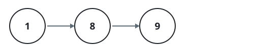
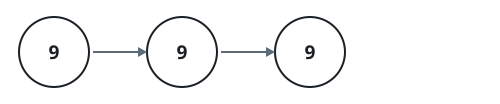

# Twice The Linked-List Number

## Description

A non-negative integer is written across a linked list, one decimal digit
per node, most significant digit first. The list is non-empty and never
carries leading zeroes — unless the number itself is `0`.

Double the number and return the head of the resulting list.

### Example 1



```text
Input: head = [1,8,9]
Output: [3,7,8]
Explanation: The figure shows the list, which spells out the number 189.
Twice 189 is 378, so the returned list reads [3,7,8].
```

### Example 2



```text
Input: head = [9,9,9]
Output: [1,9,9,8]
Explanation: The figure shows the list for 999. Doubling it produces 1998,
one digit longer than the input, so the returned list is [1,9,9,8].
```

### Example 3

```text
Input: head = [5,6,4]
Output: [1,1,2,8]
Explanation: The list spells out 564, and twice 564 is 1128. A leading
node for the new most significant digit 1 is prepended to the result.
```

### Example 4

```text
Input: head = [0]
Output: [0]
Explanation: The number is 0, and twice 0 is still 0, so the list is
returned unchanged.
```

### Constraints

- The number of nodes in the list is in the range `[1, 10⁴]`.
- `0 <= Node.val <= 9`
- The input is generated such that the list represents a number without
  leading zeroes, except the number `0` itself.

## Hints

### Hint 1

Each node's new value is decided by its own digit together with what the
less significant part of the number does — work top down.

### Hint 2

Doubling a digit of 5 or more produces a carry all by itself, while a digit
of 4 or less stays put even after an incoming carry of 1, since
`2 * 4 + 1 = 9`.

### Hint 3

If the original head digit was 5 or more, the doubled number is one digit
longer: create a fresh node holding 1 and point it at the rewritten head.
