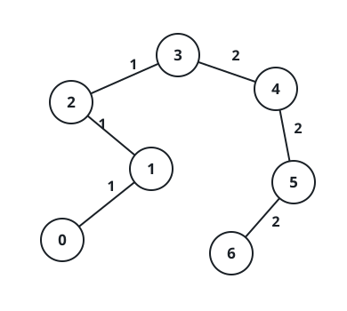
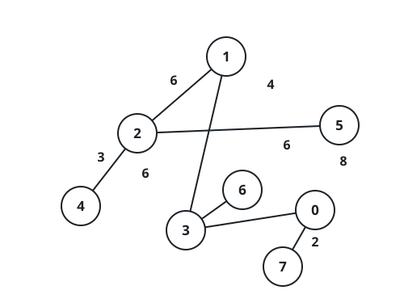

# Leveling Edge Weights Along Tree Paths

## Description

An undirected tree contains `n` nodes numbered `0` through `n - 1`. Along
with `n`, you receive its `n - 1` connections as `edges[i] = [ui, vi, wi]` —
node `ui` joined to node `vi` by an edge of weight `wi` — and a list of `m`
queries `queries[i] = [ai, bi]`.

Treat each query independently: in one operation you may take any edge of
the tree and overwrite its weight with any value, and a query is settled
once every edge along the route from `ai` to `bi` carries one shared weight.
Report, for each query, the smallest number of operations that settles it.

- Queries never influence one another; each one starts from the original
  tree, so any weights changed while settling a query are undone before the
  next.
- The route from `ai` to `bi` visits distinct nodes, starts at `ai`, ends at
  `bi`, and moves only between adjacent nodes that share a tree edge.

Return an array `answer` of length `m` in which `answer[i]` is the cost of
settling the `i`th query.

### Example 1



```text
Input: n = 7, edges = [[0,1,1],[1,2,1],[2,3,1],[3,4,2],[4,5,2],[5,6,2]], queries = [[0,3],[3,6],[2,6],[0,6]]
Output: [0,0,1,3]
```

Explanation: The route from 0 to 3 travels over three edges that already all
weigh 1, and the route from 3 to 6 sits entirely on weight-2 edges, so the
first two queries cost nothing. From 2 to 6, one weight-1 edge (between 2
and 3) interrupts an otherwise uniform run of weight-2 edges; retuning that
single edge settles the third query for a cost of 1. From 0 to 6 the path
holds three weight-1 edges and three weight-2 edges, so keeping the
weight-2 majority and overwriting the other three costs 3 — the cheapest
possible for each query, giving `answer = [0,0,1,3]`.

### Example 2



```text
Input: n = 8, edges = [[1,2,6],[1,3,4],[2,4,6],[2,5,3],[3,6,6],[3,0,8],[7,0,2]], queries = [[4,6],[0,4],[6,5],[7,4]]
Output: [1,2,2,3]
```

Explanation: From 4 to 6 the route crosses three weight-6 edges plus the
lone weight-4 edge between 1 and 3; overwriting that edge settles it for 1.
From 0 to 4, the pair of weight-6 edges is already the majority, and the
weight-8 edge (0–3) and weight-4 edge (3–1) are rewritten — 2 operations.
From 6 to 5 the majority is again the two weight-6 edges, with the 3–1 and
2–5 edges retuned, again 2. From 7 to 4, the five-edge route carries only
two weight-6 edges, so its other three (weights 2, 8, and 4) must all be
rewritten — 3 in total, hence `answer = [1,2,2,3]`.

### Constraints

- `1 <= n <= 10⁴` and `edges.length == n - 1`
- Every edge is given as `[ui, vi, wi]` with `0 <= ui, vi < n` and
  `1 <= wi <= 26`
- `edges` is guaranteed to form a valid tree over the `n` nodes
- `1 <= queries.length == m <= 2 * 10⁴`
- Every query is a pair `[ai, bi]` with `0 <= ai, bi < n`

## Hints

### Hint 1

One operation rewrites exactly one edge, so the cheapest plan keeps the
path's most frequent weight and pays once for every other edge on the path.

### Hint 2

Weights never exceed 26, which makes per-node counters affordable: store,
for every node, how many edges of each weight lie between the root and that
node, and obtain path counts as the two root prefixes minus twice the value
at the fork node — the lowest common ancestor.

### Hint 3

The lowest common ancestor of each queried pair comes fast out of a
binary-lifting ancestor table (or an offline Tarjan sweep).
